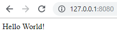

# Node.js Installation and First Application

Node.js is widely used for building scalable and high-performance applications, particularly for server-side development. It is commonly employed for web servers, APIs, real-time applications, and microservices.

- Perfect for handling concurrent requests due to its non-blocking I/O model.
- Used in building RESTful APIs, real-time applications like chats, and more.

<details>
    <summary><strong>Setting Up Node.js</strong></summary>

> To start using Node.js, you’ll first need to install it on your system.

Step 1: Download and Install Node.js
> Install Node.js by downloading the appropriate installer for your operating system and following the installation steps.
Step 2: Verify Installation
> Once installed, you can verify the installation by opening your terminal and typing the following commands:

```bash
node -v
npm -v
```
Step 3: Create a Node.js Project
> Create a new project directory.
```bash
mkdir node-project
cd node-project
```
Step 4: Initialize the Project
> Generate a package.json file using npm.
```bash
npm init -y
```
Step 5: Create an index.js File
> Create a new file named index.js in your project directory.
Step 6: Import the Required Module
> Import the built-in http module.
```js
const http = require("http");
```
Step 7: Create an HTTP Server
> Create a server using the createServer() method. The callback function handles incoming requests and sends responses.
```js
const server = http.createServer((req, res) => {
    res.writeHead(200, { "Content-Type": "text/html" });
    res.end("Hello World!");
});
```
Step 8: Start the Server
> Bind the server to a port using the listen() method.
```js
server.listen(3000, () => {
    console.log("Server running on port 3000");
});
```
Step 9: Run the Application
> Execute the following command in the terminal.
```bash
node index.js
```
> Output
```bash
Server running on port 3000
```
> Open http://localhost:3000 in your browser to see:



</details>