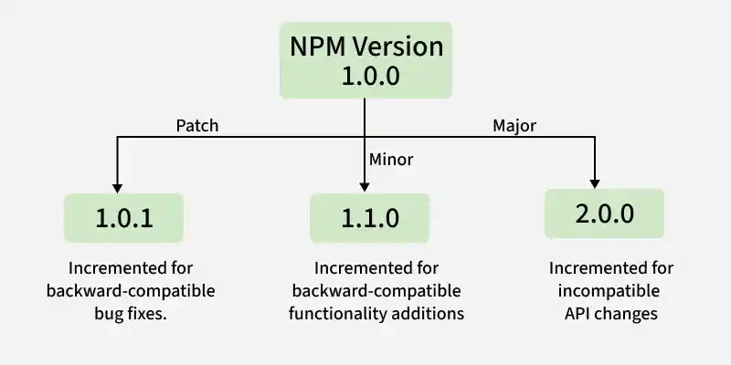

# NodeJS NPM

NPM (Node Package Manager) is the default package manager for Node.js. It helps manage project dependencies, scripts, and third-party libraries, and is automatically installed with Node.js.

- It is mainly used to manage packages or modules, which are pre-built pieces of code that extend your Node.js application.
- The NPM registry hosts millions of free packages that you can download and use in your projects.

<details>
    <summary><strong>Package in Node.js</strong></summary>
    
> A package in NodeJS is a reusable module of code that adds functionality to your application. It can be anything from a small utility function to a full-featured library.

- Packages can be installed from the NPM registry.
- You can easily install, update, or remove packages with NPM commands.

> Note: NPM packages are stored in the node_modules folder in your project.
</details>

---

<details>
    <summary><strong>Using NPM with NodeJS</strong></summary>

> To start using NPM in your project, follow these simple steps

Step 1: Install NodeJS and NPM
> NPM is bundled with the NodeJS installation.

Step 2: Initialize a New NodeJS Project
> In the terminal, navigate to your project directory and run:
```bash
npm init -y
```
This will create a package.json file, which stores metadata about your project, including dependencies and scripts.

Step 3: Install Packages with NPM
> To install a package, use the following command
```bash
npm install <package-name>
```
For example, to install the Express.js framework
```bash
npm install express
```
This will add express to the node_modules folder and automatically update the package.json file with the installed package information.

Step 4: Run Scripts
You can also define custom scripts in the package.json file under the "scripts" section. For example:
```json
{
    "scripts": {
        "start": "node app.js"
    }
}
```
Then, run the script with
```bash
npm start
```
Installing Packages Globally
To install packages that you want to use across multiple projects, use the -g flag:
```bash
npm install -g <package-name>
```
</details>

---

<details>
    <summary><strong>Using NPM Package in the project</strong></summary>

> Create a file named app.js in the project directory to use the package

```js
//app.js

const express = require('express');//import the required package
const app = express();

app.get('/', (req, res) => {
    res.send('Hello, World!');
});

app.listen(3000, () => {
    console.log('Server running at http://localhost:3000');
});
```

- express() creates an instance of the Express app.
- app.get() defines a route handler for HTTP GET requests to the root (/) URL.
- res.send() sends the response “Hello, World!” to the client.
- app.listen(3000) starts the server on port 3000, and console.log() outputs the server URL.
</details>

---

<details>
    <summary><strong>Managing Project Dependencies</strong></summary>

<details>
    <summary><strong>1. Installing All Dependencies</strong></summary>
    
In a NodeJS project, dependencies are stored in a package.json file. To install all dependencies listed in the file, run:
```bash
npm install
```
This will download all required packages and place them in the node_modules folder.
</details>

<details>
    <summary><strong>2. Installing a Specific Package</strong></summary>
    
To install a specific package, use:
```bash
npm install <package-name>
```
You can also install a package as a development dependency using:
```bash
npm install <package-name> --save-dev
```

<details>
    <summary><strong>Usage of Flags:</strong></summary>
    
- --save: flag one can control where the packages are to be installed.
- --save-prod : Using this packages will appear in Dependencies which is also by default.
- --save-dev : Using this packages will get appear in devDependencies and will only be used in the development mode.

> Note: If there is a package.json file with all the packages mentioned as dependencies already, just type npm install in terminal
</details>


</details>


<details>
    <summary><strong>3. Updating Packages</strong></summary>

> You can easily update packages in your project to their latest compatible versions based on the version constraints using the following command:
```bash
npm update
```
To update a specific package, run:
```bash
npm update <package-name>
```
</details>

<details>
    <summary><strong>4. Uninstalling Packages</strong></summary>

> To uninstall packages using npm, follow the below syntax:
```bash
npm uninstall <package-name>
```
For uninstall Global Packages
```bash
npm uninstall package_name -g
```
</details>
</details>

---

<details>
    <summary><strong>Popular NPM Packages for NodeJS</strong></summary>

> NPM has a massive library of packages. Here are a few popular packages that can enhance your NodeJS applications

- Express : A fast, minimal web framework for building APIs and web applications.
- Mongoose: A MongoDB object modeling tool for NodeJS.
- Axios: A promise-based HTTP client for making HTTP requests.
- React: A popular front-end library for building user interfaces.
- Dotenv: Loads environment variables from a .env file into process.env.
- Nodemon: Automatically restarts the Node.js server when file changes are detected during development.
- Socket.io: Enables real-time, bidirectional communication between clients and servers.
</details>

---

<details>
    <summary><strong>Versioning in NPM</strong></summary>
    
> NPM allows you to manage package versions. This is important when you want to ensure that a specific version of a library is used across all environments.



Install a Specific Version
> To install a specific version of a package, use:
```bash
npm install <package-name>@<version>
```
For example:
```bash
npm install express@4.17.1
```
This will install version 4.17.1 of Express, regardless of the latest version.
</details>