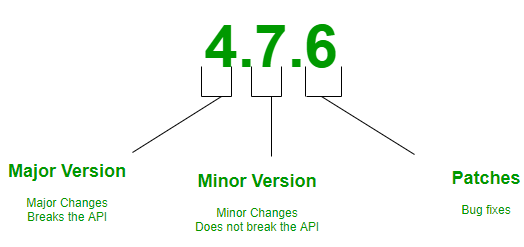
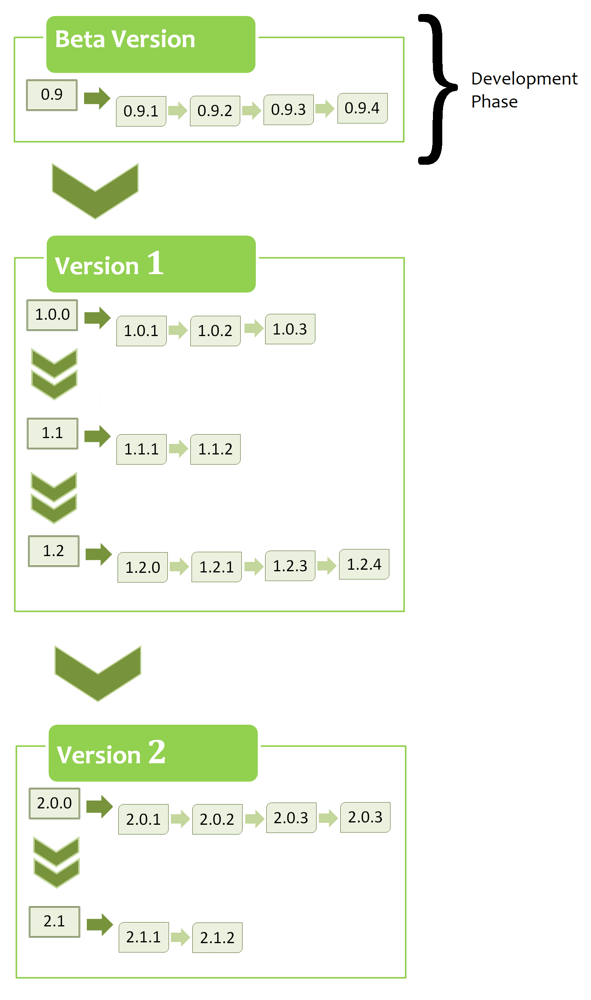
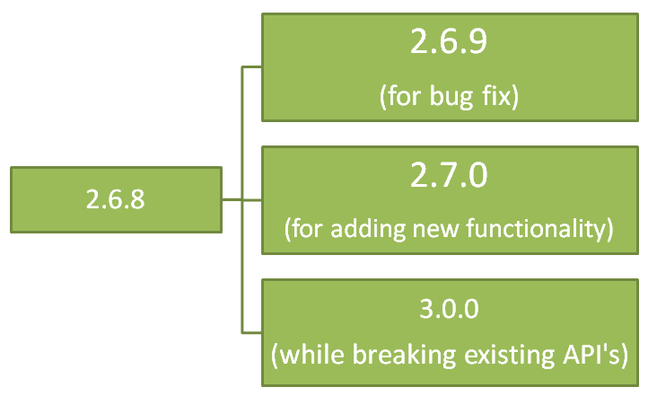

# Introduction to Semantic Versioning

    
<strong>Introduction</strong>

    
Semantic versioning (also known as SemVer) is a versioning system that has been on the rise over the last few years. It has always been a problem for software developers, release managers and consumers. Having a universal way of versioning the software development projects is the best way to track what is going on with the software as new plugins, addons, libraries and extensions are being built almost every day. This problem can be solved by Semantic Versioning. In brief, it's a way for numbering the software releases.

- So, SemVer is in the form of Major.Minor.Patch. 

Semantic Versioning is a 3-component number in the format of X.Y.Z, where :  

    
<strong>X stands for a major version.</strong>

    
The leftmost number denotes a major version. When you increase the major version number, you increase it by one but you reset both patch version and minor versions to zero. If the current version is 2.6.9 then the next upgrade for a major version will be 3.0.0. Increase the value of X when breaking the existing API.

    
<strong>Y stands for a minor version.</strong>

It is used for the release of new functionality in the system. When you increase the minor version, you increase it by one but you must reset the patch version to zero. If the current version is 2.6.9 then the next upgrade for a minor version will be 2.7.0. Increase the value of Y when implementing new features in a backward-compatible way.

    
<strong>Z stands for a Patch Versions.</strong>

    
Versions for patches are used for bug fixes. There are no functionality changes in the patch version upgrades. If the current version is 2.6.9 then the next version for a patch upgrade will be 2.6.10. There is no limit to these numbers. Increase the value of Z when fixing bugs

Valid identifiers are in the set [A-Za-z0-9] and cannot be empty. Pre-release metadata is identified by appending a hyphen to the end of the SemVer sequence. Thus a pre-release for version 1.0.0 could be 1.0.0-alpha.1. Then if another build is needed, it would become 1.0.0-alpha.2, and so on. Note that names cannot contain leading zeros, but hyphens are allowed in names for pre-release identifiers. 

---

    
<strong>Advantages of SemVer</strong>

    
- You can keep track of every transition in the software development phase.
- Versioning can do the job of explaining the developers about what type of changes have taken place and the possible updates that should take place in the software.
- It helps to keep things clean and meaningful.
- It helps other people who might be using your project as a dependency.

---

    
<strong>Points to keep in mind</strong>

    
- The first version starts at 0.1.0 and not at 0.0.1, as no bug fixes have taken place, rather we start with a set of features as the first draft of the project.
- Before 1.0.0 is only the Development Phase, where you focus on getting stuff done. This stage is for developers in which the system is being developed.
- SemVer does not cover libraries tagged 0.*.*. The first stable version is 1.0.0.

---