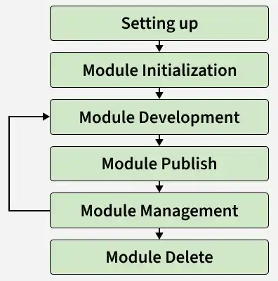
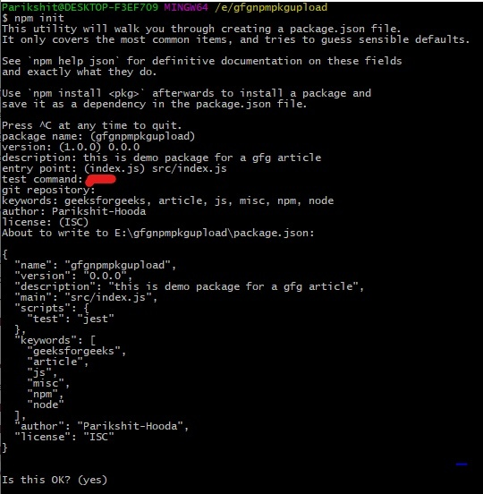
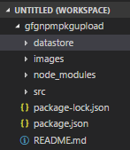
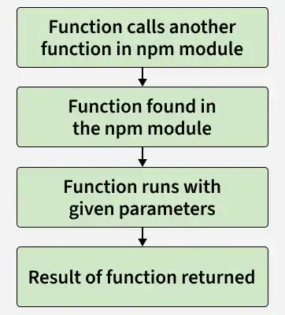
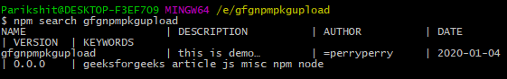
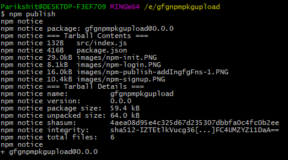
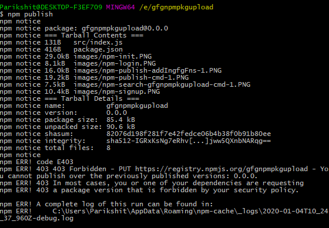

# Creating and Publishing npm Packages

Creating and publishing an npm package involves preparing your project, configuring it properly, and publishing it to the npm registry for public use.



- Initialize the project using npm init and configure the package.json file properly.
- Add your module code, test it, and ensure proper versioning and documentation.
- Login using npm login and publish the package with npm publish.

<details>
    <summary><strong>Steps for Building and Publishing an npm Package</strong></summary>
    
It explains the complete lifecycle of an npm package, from initial setup and module creation to publishing, version management, and maintenance.

<details>
    <summary><strong>1. Initializing a module</strong></summary>
    
To initialize a module, go to the terminal/command-line and type npm init and answer the prompts.


- Set a proper entry point (commonly src/index.js) and add "type": "module" to enable ES modules.
- Provide package metadata such as the repository, author, and license.
- Include a README.md and maintain a clean project structure.

</details>

---

<details>
    <summary><strong>2. Building a module</strong></summary>
    
This phase is the coding phase. If you have any experience in using NPM modules, you would know that NPM modules expose methods that are then used by the project. A typical control flow is:



Implement a simple function that adds two numbers in the npm module.

File Name: index.js

```js
export const gfgFns = {
  add: function addTwoNums(num1, num2) {
    return num1 + num2;
  },
};
```

- index.js serves as the entry point of the npm module.
- gfgFns is an exported object containing the add method to add two numbers.
- The object is exported using export const gfgFns, allowing it to be imported in other files.
</details>

---

<details>
    <summary><strong>3. Publishing a module</strong></summary>
    
Before publishing, ensure the package name is available, as duplicate names cannot be published, then publish the package using npm publish.

```bash
npm search packagename
```

If your package name is usable, it should show something like the image below.


If your module name already exists, go to the package.json file of the npm module project and change the module name to something else.

Now after checking the name availability, go to command-line/terminal and do the following:

```bash
npm publish
```

</details>

---

<details>
    <summary><strong>4. Updating and managing versions</strong></summary>

As a package evolves, versioning is required to track bug fixes, minor updates, and major releases; npm supports semantic versioning. 

> Note: If the module is being re-published without bumping up the version, the NPM command line will throw an error. For example, look at the below image.


</details>
</details>

---
