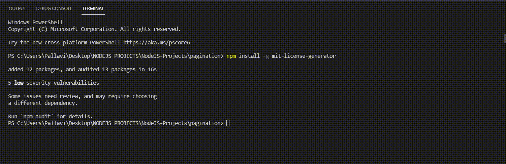
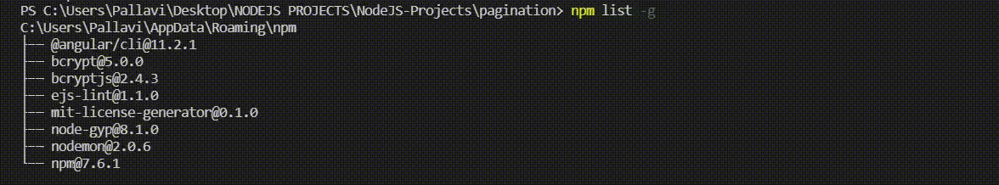

# Global Installation of Dependencies in Node.js

Dependencies are external packages or libraries that a Node.js project needs to run properly and are managed using npm.

- Installed using npm to add required functionality to a project.
- Can be installed locally (project-specific) or globally (system-wide).
- Listed in package.json to manage and track project requirements.

<details>
    <summary><strong>Concept of Global Package Installation</strong></summary>
    
Global installation of dependencies in Node.js allows packages to be installed system-wide so they can be accessed across all projects without reinstalling them individually.

- System-Wide Access: Packages can be used from any project on the system.
- Single Installation: Eliminates the need to install the same package multiple times.
- Executable Commands: Provides global command-line tools accessible from anywhere.
</details>

---

<details>
    <summary><strong>Installing Dependencies Globally in Node.js</strong></summary>

To install a package globally using npm, you can use the -g or --global flag. This flag tells npm to install the package globally, making it accessible system-wide.

<details>
    <summary><strong>Using npm</strong></summary>
    
The primary way to install a package globally is by using the npm install -g command. Here’s the general syntax:
```bash
npm install -g <package-name>
```
Example
```bash
npm install -g mit-license-generator
```
Output:

</details>

---

<details>
    <summary><strong>Check if the Package is Installed Globally</strong></summary>
    
To verify that the package has been installed globally, you can use the following command:

```bash
npm list -g
```


Uninstalling a Global Package

If you no longer need a globally installed package, you can uninstall it using the npm uninstall -g command:
```bash
npm uninstall -g <package-name>
```
</details>
</details>

---

<details>
    <summary><strong>Location of Global Packages</strong></summary>
    
When you install a package globally, npm installs it in a system-wide directory. The exact location varies depending on your operating system:

- macOS/Linux: Global packages are typically installed in /usr/local/lib/node_modules.
- Windows: On Windows, global packages are installed in %AppData%\npm\node_modules.
You can check the global installation path by running:

```bash
npm config get prefix
```
This will display the directory where globally installed npm packages reside.
</details>

---

<details>
    <summary><strong>Usage of Global Installation</strong></summary>
    
Global installation is used to make Node.js tools and packages accessible system-wide across all projects.

- Reusability Across Projects: Use the same package in multiple projects without reinstalling it.
- Command-Line Accessibility: Run tools like webpack or eslint from anywhere in the system.
- Simplified Usage: Execute globally installed tools without navigating to specific project folders.
- Cleaner Projects: No need to add global tools to each project’s package.json.
</details>

---

<details>
    <summary><strong>Best Practices for Global Installation</strong></summary>
    
While global installation is a powerful feature of npm, it’s essential to follow best practices to ensure you’re using it effectively:

- Install command-line tools globally: Tools like create-react-app, webpack, and eslint can be installed globally for use across projects.
- Use local installation for project dependencies: Libraries such as React or Express should be installed locally to prevent version conflicts.
- Manage Node.js versions with nvm: Use nvm to switch between different Node.js versions when needed.
- Remove unused global packages: Regularly uninstall unnecessary global packages to maintain a clean system.
</details>

---