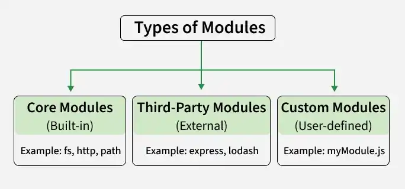

# Modules

Understand how to organize and reuse code using different types of modules.

Modules in Node.js are reusable blocks of code that help organize applications into separate files. They improve code maintainability, reusability, and structure.

- Encapsulate related functionality in separate files.
- Can be imported using require() or import.
- Promote modular and maintainable application development.

<details>
    <summary><strong>Types of Modules</strong></summary>

Node.js supports different types of modules that help organize and reuse code efficiently in applications.



<details>
    <summary><strong>1. Core Modules:</strong></summary>
    
Built-in modules provided by Node.js that offer essential features like file handling (fs), HTTP servers (http), and utilities (util). They can be accessed using require() without specifying a path.

```js
const fs = require('fs');
```
</details>

---

<details>
    <summary><strong>2. Third-Party Modules:</strong></summary>
    
Modules created by external developers and available on npm. They can be installed using npm and imported into applications using require().

```js
npm install package-name
const package = require('package-name');
```
</details>

---

<details>
    <summary><strong>3. Custom Modules:</strong></summary>
    
Custom modules are user-defined modules created to encapsulate reusable code, which can be exported using module.exports or exports and used in other files.

```js
// index.js
const math = require('./math');
console.log(math.add(5, 3));

// math.js
exports.add = (a, b) => a + b;
exports.subtract = (a, b) => a - b;
```
</details>
</details>

---

<details>
    <summary><strong>Benefits of Using Modules</strong></summary>
    
Using modules improves code organization, reusability, maintainability, and scalability in Node.js applications.

- Encapsulation: Modules hide implementation details and expose only required functionalities.
- Code Reusability: Modules enable reuse of code across different parts of an application.
- Scalability: Modules help organize code into smaller, manageable units, making it easier to scale applications as they grow in complexity.
- Maintainability: Modular structure makes code easier to update and maintain.
</details>

---


