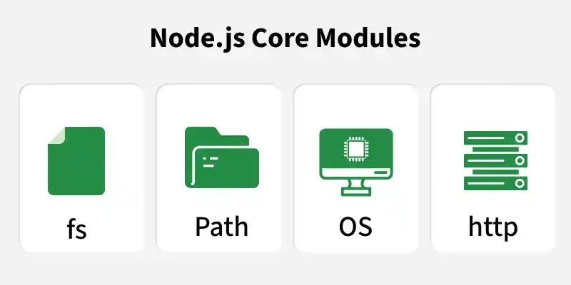

# Node.js Core Modules

Node.js is a JavaScript runtime built on Chrome’s V8 engine that enables server-side development. Its core modules are built-in libraries that provide essential features for building efficient and scalable applications.

- Pre-installed modules (no external installation needed)
- Improve performance and application scalability
- Common examples: fs, http, path



To use a core module, you simply use the require() function:

```js
const fs= require('fs');
```

<details>
    <summary><strong>List of Commonly Used Node.js Core Modules</strong></summary>
    
A collection of built-in Node.js modules that provide essential functionalities like file handling, networking, and system operations without requiring installation

<details>
    <summary><strong>1. fs (File System)</strong></summary>
    
The fs (File System) module in Node.js is a built-in module used to interact with the file system. It supports both synchronous and asynchronous operations for handling files and directories efficiently.

- Used to create, read, update, delete, and rename files and directories.
- Supports both synchronous and asynchronous operations.
- fs.readFile() reads file content asynchronously and returns an error or the file content.

```js
// fs.js
const fs = require('fs');

fs.readFile('Lucas.txt', 'utf8', (err, data) => {
    if (err) {
        throw err;
    }
    console.log(data);
});
```

```txt
// Lucas.txt
Lucas, You have Created file system successfully
```
> Note: When running a file using Node.js, it does not automatically watch for changes. If you make any changes to the file, you need to manually stop and restart the application for the updates to take effect.
</details>

---

<details>
    <summary><strong>2. http and https(HTTP/HTTPS)</strong></summary>
    
The http module and https modules in Node.js are built-in modules used to create HTTP and HTTPS servers and handle web requests securely. They allow developers to build web servers, RESTful APIs, and interact with web services.

- Import the module using require('http').
- Create an HTTP server using http.createServer() to handle requests and responses.
- Start the server using server.listen() on a specified port.

```js
const http = require('http');
const myServer = http.createServer((req, res) => {
    res.end('Hello Lucas, this is your first HTTP server');
});
myServer.listen(8080, () => {
    console.log('Lucas, your server is running on port 8080');
});
```
This result of running the Node.js server using node, which will start your server on provided port no.

- The https module creates secure servers using SSL/TLS encryption and is similar to the http module.
- Used for secure communication and handling sensitive data like login details or payments.
</details>

---

<details>
    <summary><strong>3. events(EventEmitter)</strong></summary>
    
Node.js follows an event-driven architecture, and the events module plays a central role in it. It provides the EventEmitter class to create and handle custom events asynchronously.

- Enables creation and handling of custom events.
- Forms the foundation for real-time and event-based applications.

```js
const EventEmitter = require('events');
const myEmitter = new EventEmitter();
myEmitter.on('Message', (msg) => {
    console.log(`Received: ${msg}`);
});
myEmitter.emit('Message', 'Hello Lucas');
```
- Imports the EventEmitter class from the events module and creates an instance myEmitter.
- Uses myEmitter.on() to listen for a 'Message' event and execute a callback function.
- Triggers the event using myEmitter.emit() and prints "Hello Lucas" to the console.
</details>

---

<details>
    <summary><strong>4. path(Path)</strong></summary>
    
The path module simplifies working with file and directory paths. It offers functions like join, resolve, and basename to manipulate and construct paths in a platform-independent way.

```js
const path = require('path');
console.log(path.basename('C:\\Users\\GFG0925-LAPTOP\\Desktop\\gfg_code\\NodeJS\\index.html'));
```
- The path.js file was executed using Node.js.
- It printed index.html to the console.
- This indicates that path.basename() was used to extract the file name from a full file path.
</details>

---

<details>
    <summary><strong>5. util(Utilities)</strong></summary>
    
The util module contains utility functions that extend JavaScript's built-in capabilities. It's particularly useful for debugging and working with objects. You'll find functions like promisify, inspect, and format here.

```js
const util =require('util');
const text=util.format('Hello %s', 'Lucas');
console.log(text);
```

It uses Node.js’s built-in util module, specifically the util.format() method, to format a string. The %s is a placeholder for a string value, which gets replaced by "Lucas" in this case.
</details>

---

<details>
    <summary><strong>6. os (Operating System)</strong></summary>
    
The os module provides information about the operating system on which Node.js is running. You can access details like CPU architecture, memory, and network interfaces. It's essential for writing platform-specific code.

```js
const os=require('os');
console.log(os.platform());
console.log(os.freemem());
console.log(os.arch());
```
</details>

---

<details>
    <summary><strong>7. crypto(Cryptography)</strong></summary>
    
For handling cryptographic operations like encryption, decryption, and creating hashes, the crypto module is indispensable. It includes functions for secure data handling and authentication.

```js
const crypto= require('crypto');
const hash= crypto.createHash('sha256');
const result= hash.update('Hello, Mahima Bhardwaj').digest('hex');
console.log(result);
```

- Uses the built-in crypto module to generate a SHA-256 hash.
- Creates a hash with crypto.createHash('sha256') and updates it with the string "Hello, Lucas".
- Converts the hash to hexadecimal using digest('hex') and prints the result to the console.

</details>
</details>

---

<details>
    <summary><strong>Usage of Core Modules
</strong></summary>
    
To use a core module, you need to require it in your Node.js script:

filename: coremodule.js
```js
const  fs =require('fs');
const path= require('path');
const http= require('http');
const util=require('util);')
```

Once required, you can access the module’s functions and classes and start using them in your application.

Example:

```js
const fs = require('fs');
fs.readFile('Lucas.txt', 'utf8', (err, data) => {
    if (err) throw err;
    console.log('File content:', data);
});
```
</details>


