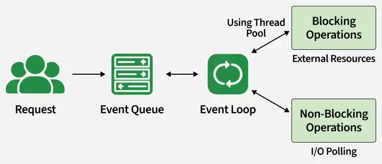

# Blocking and Non-Blocking in NodeJS

In Node.js, blocking code waits for a task to complete before moving forward, while non-blocking code allows other operations to proceed without waiting.

- Blocking code pauses execution until completion.
- Non-blocking code runs tasks asynchronously without waiting.
- Non-blocking improves performance and scalability.

>  

<details>
    <summary><strong>Blocking in NodeJS</strong></summary>
    
When your code runs a task, it stops and waits for that task to completely finish before moving on to the next thing. It's like reading a book one word at a time, never skipping ahead.

- The program waits patiently for the current operation to finish.
- No other code can run until that operation is done.

```js
function myFunction() {
    console.log("Starting a task...");
    // Simulate a long-running task (blocking)
    let sum = 0;
    for (let i = 0; i < 1000000000; i++) { // A big loop!
        sum += i;
    }
    console.log("Task finished!");
    return sum;
}

console.log("Before the function call");
let result = myFunction(); 
console.log("After the function call");
console.log("Result:", result);
```

- The for loop acts like a long-running task. The program waits for it to complete.
- The "After the function call" message doesn't print until the loop is totally done.
- This makes the code run step-by-step, one thing at a time.

<details>
    <summary><strong>Blocking HTTP Server</strong></summary>

A blocking server handles one request at a time. If it's busy reading a file for one user, other users have to wait.

```js
const http = require('http');
const fs = require('fs');
http.createServer((req, res) => {
    const data = fs.readFileSync('largeFile.txt', 'utf8'); // Blocking!
    res.end(data);
}).listen(3000);

console.log("Server running at http://localhost:3000/");
```

- fs.readFileSync is blocking. The server stops and waits until the entire largeFile.txt is read.
- If another user tries to access the server while it's reading the file, they have to wait.
    
</details>
</details>

---

<details>
    <summary><strong>Non-Blocking in NodeJS</strong></summary>
    
Non-blocking means your program can keep doing other things while a task is running in the background. It doesn't have to stop and wait for that task to finish before moving on.

- The program doesn't wait for the current task to complete.
- Other code can run while the task is working in the background.

```js
function myFunction() {
    console.log("Starting a task...");

    // Non-blocking I/O operation (file read)
    const fs = require('fs');

    fs.readFile('file.txt', 'utf8', (err, data) => {
        if (err) {
            console.error("Error reading file");
            return;
        }

        console.log("Task finished!");
        console.log("File content:", data);
    });
}

console.log("Before the function call");
myFunction(); // The program doesn't wait here
console.log("After the function call");
```

- The fs.readFile operation runs asynchronously without blocking the program.
- "After the function call" prints before "Task finished!" because the callback runs later via the event loop.
- This allows the program to handle multiple operations efficiently.

Non-Blocking HTTP Server

A non-blocking server can handle many requests at the same time. If it needs to read a file, it starts the read and then goes back to handling other requests. When the file is ready, the server is told about it and then it can send the data to the user.

```js
const http = require('http');
const fs = require('fs');

http.createServer((req, res) => {
    fs.readFile('largeFile.txt', 'utf8', (err, data) => { // Non-blocking!
        if (err) {
            res.writeHead(500);
            res.end("Error reading file");
            return;
        }
        res.end(data);
    });
}).listen(3000);
console.log("Server running at http://localhost:3000/");
```

- fs.readFile is non-blocking, allowing the server to handle other requests while the file is being read.
- This approach is much more efficient for concurrent requests, as the server remains responsive and doesn't wait for I/O operations to complete.
</details>

---
<details>
    <summary><strong>Understanding Non-Blocking I/O in Node.js</strong></summary>
    
NodeJS handles non-blocking I/O using

- The Event Loop: A single thread (the event loop) manages asynchronous operations. When a task like file I/O or a network request is initiated, NodeJS delegates it and doesn't wait. The event loop continues processing other events.
- Callbacks: When the I/O operation completes, NodeJS is notified and executes a callback function associated with that task. This callback handles the result of the operation.
- Thread Pool: Certain tasks (like some file operations or computations) are handled by a thread pool. This prevents these tasks from blocking the event loop. The thread pool also uses callbacks to notify the event loop when a task is done.
</details>

---
<details>
    <summary><strong>Handling Concurrency and Throughput in Node.js</strong></summary>
    
Node.js is single-threaded but achieves concurrency using the event loop, which handles I/O operations efficiently and executes callbacks once tasks are completed.

- Concurrency: The event loop manages multiple operations, ensuring non-blocking asynchronous tasks are handled efficiently.
- Throughput: Non-blocking asynchronous operations are significantly faster than blocking synchronous ones, which helps in maximizing throughput.
</details>

