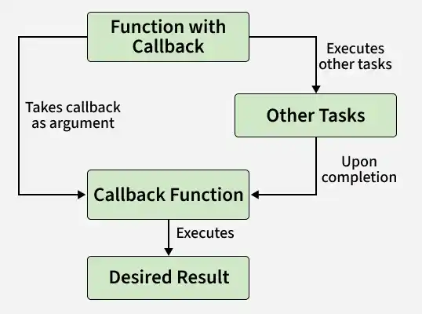

# Node Callback Concept

In Node.js, callbacks enable asynchronous, non-blocking execution, while methods like readFileSync() perform blocking operations. The fs module provides both synchronous and asynchronous approaches to handle file system tasks.

- Callback Function: Executes after a task completes, enabling non-blocking processing.
- Improves Scalability: Allows handling multiple requests without waiting for operations to finish.
- readFileSync(): A synchronous method that blocks execution until the file is fully read.
- Asynchronous Methods: Continue execution while file operations run in the background.



Example: Code for reading a file synchronously (blocking code) in Nodejs. Create a text file inputfile1.txt with the following content:

```js
// Write JavaScript code
const fs = require("fs");
const filedata = fs.readFileSync('inputfile1.txt');
console.log(filedata.toString());
console.log("End of Program execution");
```
- The fs library is used to perform file system operations in Node.js.
- The asynchronous readFile() function allows the program to continue execution while the file is being read in the background.
- A callback function is executed after the file-reading operation is completed.

Example : Code for reading a file asynchronously (non-blocking code) in Nodejs. Create a text file inputfile1.txt with the following content.

```js
// Write a JavaScript code
const fs = require("fs");

fs.readFile('inputfile1.txt',
    function (ferr, filedata) {
        if (ferr) return console.error(ferr);
        console.log(filedata.toString());
    }
);
console.log("End of Program execution");
```
- The fs.readFile() function reads the file asynchronously (non-blocking).
- The program does not wait for the file to be read.
- "End of Program execution" is printed first.
- The file content is printed later when the callback runs.


