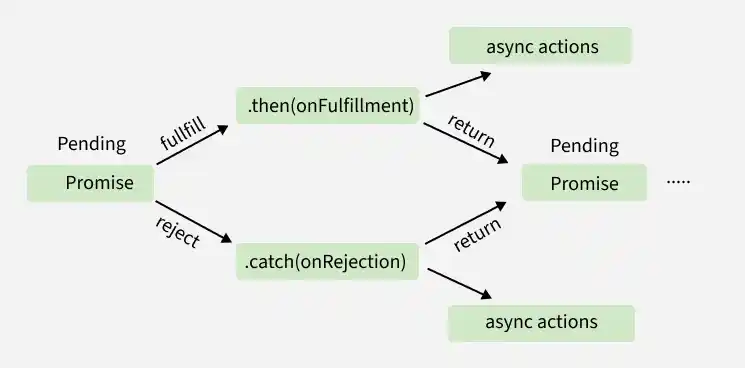

# JavaScript Promise Chaining

Promise chaining allows you to execute a series of asynchronous operations in sequence. It is a powerful feature of JavaScript promises that helps you manage multiple operations, making your code more readable and easier to maintain.

- Allows multiple asynchronous operations to run in sequence.
- Reduces callback hell by eliminating deeply nested functions.
- Each then() returns a new promise, allowing further chaining.
- Error handling is easier with a single .catch() for the entire chain.



```js
function task(message) {
  return new Promise((resolve) => {
    console.log(message);
    resolve();
  });
}
task("Task 1 completed")
  .then(() => task("Task 2 completed"))
  .then(() => task("Task 3 completed"))
  .catch((err) => console.error(err));
```

- task(): Returns a resolved Promise that immediately logs the message, without using setTimeout.
- .then(): Ensures each task runs after the previous Promise completes, maintaining execution order.
- The tasks execute sequentially, printing: Task 1 completed → Task 2 completed → Task 3 completed.
- Linking Promises step by step using .then() is known as Promise Chaining.

---

<details>
    <summary><strong>Error Handling</strong></summary>
    
Error Handling in Promise Chaining provides a structured way to catch and manage errors that occur at any step in a chain, ensuring failures are handled gracefully without breaking the entire asynchronous flow.

```js
Promise.resolve(5)
  .then((num) => {
    console.log(`Value: ${num}`);
    throw new Error("Something went wrong!");
  })
  .then((num) => {
    console.log(`This won't run`);
  })
  .catch((error) => {
    console.error(`Error: ${error.message}`);
  });
```

- Promise.resolve(5) resolves with value 5, which is logged in the first .then(), but throwing an error there immediately rejects the Promise.
- Once rejected, all subsequent .then() blocks are skipped, and control moves directly to .catch().
- The .catch() handles the error, logs the message, and prevents the application from crashing.
</details>

---

<details>
    <summary><strong>Chaining with Dependent Tasks</strong></summary>
    
Chaining with Dependent Tasks refers to executing asynchronous operations in sequence where each .then() depends on the result of the previous Promise, ensuring correct order and data flow between tasks.

```js
function fetchUser(userId) {
    return Promise.resolve({ id: userId, name: "GFG" });
}

function fetchOrders(user) {
    return Promise.resolve([{ orderId: 1, userId: user.id }]);
}

fetchUser(101)
    .then((user) => {
        console.log(`User: ${user.name}`);
        return fetchOrders(user);
    })
    .then((orders) => {
        console.log(`Orders: ${orders.length}`);
    })
    .catch((error) => console.error(error));
```

fetchUser(userId) returns a Promise with the user object, and the first .then() logs the name and passes that user to fetchOrders(user), so each step gets the data it depends on.
Returning fetchOrders(user) makes the chain wait until the order Promise resolves, and the second .then() then receives the orders and logs their count.
A single .catch() handles errors from any part of the chain, keeping the whole flow clean and easy to manage.
</details>

---

<details>
    <summary><strong>Parallel and Sequential Tasks in a Chain</strong></summary>
    
You can combine Promise.all() with chaining for efficient execution.

```js
Promise.all([
    Promise.resolve("Task 1 done"),
    Promise.resolve("Task 2 done")
])
    .then(([result1, result2]) => {
        console.log(result1, result2);
        return Promise.resolve("Final Task done");
    })
    .then((finalResult) => console.log(finalResult))
    .catch((error) => console.error(error));
```

- Promise.all([...]) runs multiple Promises in parallel and waits until all of them are resolved.
- The resolved values are returned as an array, which is destructured into result1 and result2.
- After both tasks complete, a new Promise is returned to continue chaining.
- The next .then() logs the final result after the previous tasks finish.
- If any Promise fails, the .catch() handles the error from the entire chain.
</details>

---

<details>
    <summary><strong>Nested Promises</strong></summary>

In JavaScript, Promises are used to handle asynchronous operations, allowing you to attach callback functions that execute when the operation is completed or fails.

```js
function fetch() {
    return new Promise((res, rej) => {
        setTimeout(() => { res("Data fetched"); },
            1000);
    });
}

function process(data) {
    return new Promise((res, rej) => {
        setTimeout(() => { res(`Processed: ${data}`); },
            1000);
    });
}

fetch()
    .then((data) => { return process(data); })
    .then(
        (processedData) => { console.log(processedData); })
    .catch((error) => { console.error(error); });
```

- fetchData returns a Promise that resolves after 1 second.
- processData takes the fetched data and returns a Promise that resolves after another second.
- The .then() methods are chained to handle the results sequentially.
- The .catch() method handles any errors that occur during the asynchronous operations.
</details>

<details>
    <summary><strong>Benefits of Promise Chaining</strong></summary>
    
- Cleaner Code: Eliminates callback nesting, making asynchronous code more readable and maintainable.
- Sequential Execution: Executes asynchronous tasks in a fixed order, making it suitable for dependent operations.
- Centralized Error Handling: A single .catch() handles errors across the entire chain, while .finally() ensures cleanup tasks always run.
- Efficient Data Flow: Passes results between promises, simplifying step-by-step workflows and data processing.
</details>
