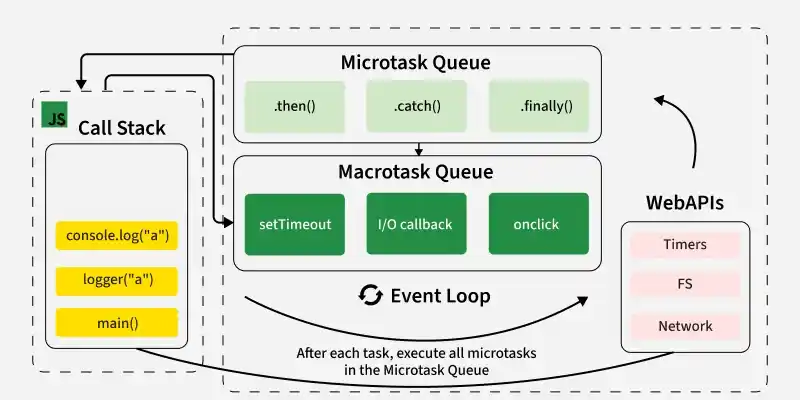
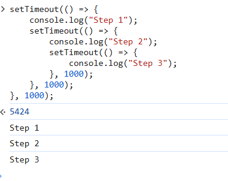

# Event Loop in JavaScript

The event loop is an important concept in JavaScript that enables asynchronous programming by handling tasks efficiently. Since JavaScript is single-threaded, it uses the event loop to manage the execution of multiple tasks without blocking the main thread.

```js
console.log("Start");

setTimeout(() => {
    console.log("setTimeout Callback");
}, 0);

Promise.resolve().then(() => {
    console.log("Promise Resolved");
});

console.log("End");
```

- console.log("Start") executes first.
- setTimeout schedules its callbacks but does not execute it immediately.
- Promise.resolve().then() is placed in the microtask queue and executes before the callback queue.
- Promise Resolved appears before setTimeout Callback due to microtask priority.

JavaScript executes code synchronously in a single thread. However, it can handle asynchronous operations such as fetching data from an API, handling user events, or setting timeouts without pausing execution. This is made possible by the event loop.

<details>
    <summary><strong>Working of Event Loop</strong></summary>
    
The event loop continuously checks whether the call stack is empty and whether there are pending tasks in the callback queue or microtask queue.



- Call Stack: JavaScript has a call stack where function execution is managed in a Last-In, First-Out (LIFO) order.
- Web APIs (or Background Tasks): These include setTimeout, setInterval, fetch, DOM events, and other non-blocking operations.
- Callback Queue (Task Queue): When an asynchronous operation is completed, its callback is pushed into the task queue.
- Microtask Queue: Promises (.then(), .catch(), .finally()) and other microtasks are placed here. The microtask queue is always fully executed (drained) before moving to the next macrotask.
- Event Loop: It continuously checks the call stack and, if empty, moves tasks from the queue to the stack for execution
</details>

---

<details>
    <summary><strong>Common Issues Related to the Event Loop</strong></summary>
    
<details>
    <summary><strong>1. Blocking the Main Thread</strong></summary>
    
Heavy computations block the event loop, making the app unresponsive.

```js
while(true)
{
    console.log('Blocking...')
}
```
* An infinite while(true) loop continuously executes without termination, blocking the event loop.
* As a result, no other tasks (UI updates, callbacks, timers) can run, causing the browser to freeze.
</details>

---

<details>
    <summary><strong>2. Delayed Execution of setTimeout</strong></summary>

setTimeout doesn’t always run exactly after the specified time.

```js
console.log("Start");
setTimeout(() => console.log("Inside setTimeout"), 1000);
for (let i = 0; i < 1e9; i++) {} // Long loop
console.log("End");
```

* A blocking loop keeps the Call Stack busy, delaying setTimeout execution.
* This can freeze the browser or cause a Time Limit Exceeded error.
</details>

---

<details>
    <summary><strong>3. Priority of Microtasks Over Callbacks</strong></summary>
    
Microtasks run before setTimeout, even if set with 0ms delay.
```js
setTimeout(() => console.log("setTimeout"), 0);
Promise.resolve().then(() => console.log("Promise"));
console.log("End");
```

* The event loop first checks the microtask queue before the callback (macrotask) queue.
* The microtask queue has higher priority than the callback queue in JavaScript.
* Therefore, functions in the microtask queue are executed before those in the callback queue.
</details>

---

<details>
    <summary><strong>4. Callback Hell</strong></summary>
    
Too many nested callbacks make code unreadable.

```js
setTimeout(() => {
    console.log("Step 1");
    setTimeout(() => {
        console.log("Step 2");
        setTimeout(() => {
            console.log("Step 3");
        }, 1000);
    }, 1000);
}, 1000);
```

This creates Callback Hell, making it hard to read and maintain. Use Promises or async/await instead.


</details>

</details>

---

<details>
    <summary><strong>Best Practices for Working with the Event Loop</strong></summary>
    
- Use Asynchronous Operations: Avoid blocking the event loop with synchronous file reads or complex calculations.
- Optimize Long-Running Tasks: Use worker threads or child processes for CPU-intensive tasks.
- Use Microtasks Wisely: Since microtasks execute before other queued tasks, excessive usage can delay other operations.
- Debug Using Performance Tools: Utilize Node.js Performance Hooks and the Chrome DevTools profiler to monitor the event loop behavior.
</details>

