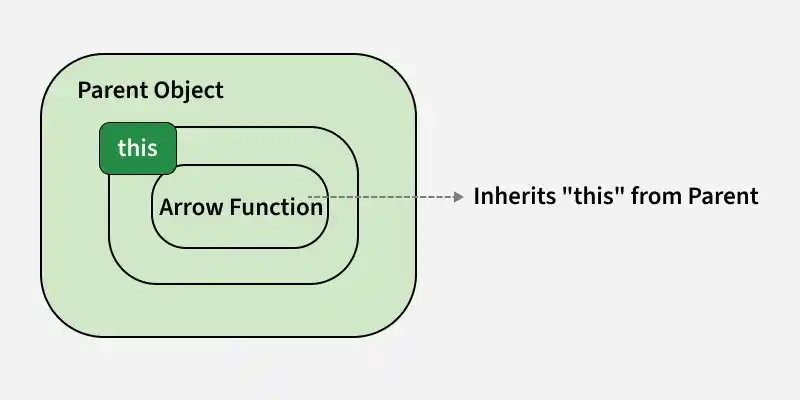
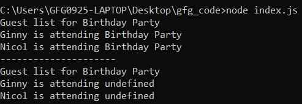

# Node.js This Binding

Arrow functions do not bind their own this and instead inherit it from the surrounding scope. This makes them useful for callbacks but unsuitable for object methods.

* Arrow functions use lexical this from the outer scope.
* Not suitable for object methods because this won’t refer to the object.
* ES6 method shorthand should be used for defining methods.
* Ideal for callbacks like forEach where outer this access is needed.



```js
// 'This' in Arrow function
const eventOne = {
    name: 'Birthday Party',
    guestList: ['Ginny', 'Nicol'],
    printGuestList() {
        console.log('Guest list for ' + this.name);
        this.guestList.forEach((guest) => {
            console.log(guest + ' is attending ' + this.name)
        });
    }
}

// 'This' in normal function
const eventTwo = {
    name: 'Birthday Party',
    guestList: ['Ginny', 'Nicol'],
    printGuestList() {
        console.log('Guest list for ' + this.name);
        this.guestList.forEach(function (guest) {
            console.log(guest + ' is attending ' + this.name)
        });
    }
}

eventOne.printGuestList();
console.log('---------------------');
eventTwo.printGuestList();
```


---

- Arrow functions use lexical this, so they access the object’s this correctly.
- In eventOne, this.name works because the arrow function inherits this.
- Normal functions have their own this, so context is lost inside forEach.
- In eventTwo, this.name becomes undefined inside the callback.

So this is how 'this' binding works on arrow functions and normal functions.

