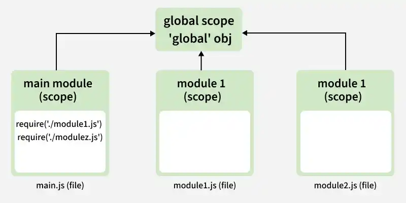
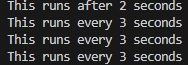

# NodeJS Global Objects

Node.js provides a global scope mechanism that allows certain variables and functions to be available across the entire application without explicit imports.

- Browsers use the window object as their global scope.
- Node.js replaces window with the global object.
- The global object stores application-wide variables and functions.
- These globals can be accessed from any file in the Node.js app.



<details>
    <summary><strong>Commonly used Global Objects in Node.js</strong></summary>
    
Node.js provides a set of global objects that are available in every module. These are built-in objects that can be used directly in the application.

<details>
    <summary><strong>1. global</strong></summary>
    
In Node.js, the global object provides a shared scope for variables and functions, similar to the window object in browsers.

* global in Node.js serves the same purpose as window in browsers.
* Variables and functions attached to global are accessible throughout the application.
* It enables application-wide access without explicit imports.

```js
global.a = 'This is a global variable';
console.log(a);  // Accessible from anywhere in the application
```

global.a = 'This is a global variable';
console.log(a);  // Accessible from anywhere in the application
</details>

---
<details>
    <summary><strong>2. console</strong></summary>

The console object in Node.js is used to output messages for logging and debugging purposes.

- Prints messages to standard output (stdout) and error output (stderr).
- Provides logging methods such as console.log(), console.error(), and console.warn().
- Commonly used for debugging and monitoring application behavior.
</details>

---
<details>
    <summary><strong>3. process</strong></summary>
    
The process object in Node.js represents the currently running application and provides access to its runtime environment.

- Exposes details like environment variables and command-line arguments.
- Allows control over application behavior during execution (e.g., exiting the process).

```js
console.log("Process ID:", process.pid);
console.log("Node.js Version:", process.version);

// Output
// Process ID: 32
// Node.js Version: v16.20.1
```
</details>

---
<details>
    <summary><strong>4. Buffer</strong></summary>
    
The Buffer class in Node.js is used to handle raw binary data directly in memory.

- Enables manipulation of binary data such as files and network streams.
- Works outside the JavaScript string encoding system for efficient data handling.

```js
const buffer = Buffer.from('Hello Node.js');
console.log(buffer);  // Outputs the binary representation

// Output
// <Buffer 48 65 6c 6c 6f 20 4e 6f 64 65 2e 6a 73>
```
</details>

---
<details>
    <summary><strong>5. __dirname and __filename</strong></summary>

__dirname and __filename are built-in global variables in Node.js that provide path information about the current module.

* __dirname returns the absolute path of the current directory.
* __filename returns the absolute path of the current file.
* Useful for resolving file and directory paths reliably.

```js
console.log(__dirname);  // Outputs the directory of the current file
console.log(__filename); // Outputs the full path of the current file

// Output
// /home/guest/sandbox
// /home/guest/sandbox/Solution.js
```
</details>

---
<details>
    <summary><strong>6. setTimeout() and setInterval()
</strong></summary>
    
Timer functions in Node.js are used to control when code executes.

setTimeout() executes a function once after a delay.
setInterval() executes a function repeatedly at fixed intervals.

```js
setTimeout(() => {
    console.log("This runs after 2 seconds");
}, 2000);

setInterval(() => {
    console.log("This runs every 3 seconds");
}, 3000);
```

</details>


---

<details>
    <summary><strong>7. URL and URLSearchParams</strong></summary>
    
Node.js provides utilities to work with URLs and their query parameters efficiently.

- URL is used to parse and construct URLs.
- URLSearchParams helps read and modify query parameters.
- Simplifies handling of URL-related operations in applications.

```js
const myURL = new URL('https://www.example.com/?name=Lily');
console.log(myURL.searchParams.get('name'));  
myURL.searchParams.append('age', '30');
console.log(myURL.href);

// Output
// Lily
// https://www.example.com/?name=Lily&age=30
```
</details>

---
<details>
    <summary><strong>8. TextEncoder and TextDecoder
</strong></summary>
    
Text encoder and decoder classes are used to convert between strings and binary data using specific encodings.

- Encode text into binary formats like UTF-8.
- Decode binary data back into readable text.

```js
const encoder = new TextEncoder();
const encoded = encoder.encode("Hello, Node.js!");
console.log(encoded);  // Outputs a Uint8Array of encoded text

// Output
// Uint8Array(15) [
//    72, 101, 108, 108, 111,
//    44,  32,  78, 111, 100,
//   101,  46, 106, 115,  33
// ]
```
</details>
</details>

---

<details>
    <summary><strong>Role of Global Objects in Node.js Applications</strong></summary>
    
Global objects in Node.js provide direct access to commonly used features without explicitly importing modules.

- Reduce the need for require or import statements.
- Allow easy access to frequently used functionality.
- Simplify development by making core features readily available across the application.
</details>

---
<details>
    <summary><strong>Usage of Global Objects in Node.js</strong></summary>
    
Global objects are helpful in situations where you need to access commonly used functionalities across your application. They are particularly useful for:

- Managing the process: The process object gives you access to process-related information and the environment.
- Working with file paths: __dirname and __filename help identify the current directory and file location, making it easier to manage relative file paths.
- Timers and intervals: The setTimeout() and setInterval() functions are helpful for controlling the flow of your application.
- Handling binary data: The Buffer object allows you to work with binary data efficiently.
</details>

---

<details>
    <summary><strong>Limitations of Global Objects in Node.js</strong></summary>
    
While global objects are convenient, they should be used with caution. Over-relying on global objects can make your code harder to test and maintain. Here are some cases when you should avoid using global objects excessively:

- Namespace Pollution: Global variables can cause naming conflicts and bugs.
- Hidden Dependencies: Overuse of globals makes code harder to understand and debug.
- Testing Issues: Globals are difficult to mock during testing.
</details>