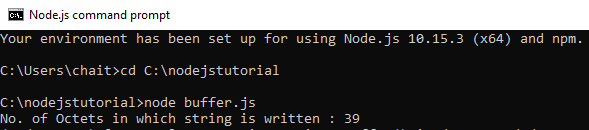

# Node.js Buffers

Node.js Buffers are used to handle binary data directly in memory. They provide a way to work with raw binary data streams efficiently, crucial for I/O operations, such as reading from files or receiving data over a network..

<strong>Buffers in Node.js</strong>

Buffers are instances of the Buffer class in Node.js. Buffers are designed to handle binary raw data. Buffers allocate raw memory outside the V8 heap. Buffer class is a global class so it can be used without importing the Buffer module in an application.

<strong>Syntax:</strong>

Following are the different ways to create buffers in Node.js:

Create an uninitiated buffer: It creates the uninitiated buffer of given size.

```js
const ubuf = Buffer.alloc(5);
```

The above syntax is used to create an uninitiated buffer of 5 octets.

Create a buffer from array: It creates the buffer from given array.

```js
const abuf = new Buffer([16, 32, 48, 64]);
```

The above syntax is used to create a buffer from given array.

Create a buffer from string: It creates buffer from given string with optional encoding.

```js
var sbuf = new Buffer("GeeksforGeeks", "ascii");
```

The above syntax is used to create a Buffer from a string and encoding type can also be specified optionally.

Writing to Buffers in Node.js: The buf.write() method is used to write data into a node buffer.

```js
buf.write( string, offset, length, encoding )
```

The buf.write() method is used to return the number of octets in which string is written. If buffer does not have enough space to fit the entire string, it will write a part of the string. 
The buf.write() method accepts the following parameters: 

- string: It specifies the string data which is to be written into the buffer.
- offset: It specifies the index at which buffer starts writing. Its default value is 0.
- length: It specifies the number of bytes to write. Its default value is buffer.length.
- encoding: It specifies the encoding mechanism. Its default value is 'utf-8'.

Example: Create a buffer.js file containing the following codes.

```js
// Write JavaScript code here
cbuf = new Buffer(256);
bufferlen = cbuf.write("Learn Programming with GeeksforGeeks!!!");
console.log("No. of Octets in which string is written : "+ bufferlen);
```
output


Reading from Buffers: The buf.toString() method is used to read data from a node buffer. 
Syntax:

```js
buf.toString( encoding, start, end )
```

The buf.toString() method accepts the following parameters: 

- encoding: It specifies the encoding mechanism. Its default value is 'utf-8'.
- start: It specifies the index to start reading. Its default value is 0.
- end: It specifies the index to end reading. Its default value is complete buffer.

> Explore the Node.js Buffer Complete Reference to uncover detailed explanations, practical usage examples, and expert tips for harnessing its powerful features to efficiently manage and manipulate binary data in your Node.js applications.

---

<strong>Features</strong>
- Direct Binary Data Handling: Allows efficient management of raw binary data, which is essential for performance-sensitive applications.
- Varied Creation Methods: Supports creation from arrays, strings, or direct allocation, providing flexibility in data handling.
- Built-in Methods: Includes methods for reading, writing, and slicing data, streamlining data manipulation tasks.
- Encoding Support: Offers various encoding formats like UTF-8 and ASCII for easy conversion between binary and text data.

---

<strong>Benefits</strong>
- Performance: Buffers are designed for high-performance operations involving binary data, making them suitable for I/O-intensive applications.
- Memory Efficiency: Directly handles binary data without the overhead of converting to and from string formats, reducing memory usage.
- Flexibility: Provides multiple ways to create and manipulate binary data, catering to different needs in data processing and network communication.
- Compatibility: Integrates seamlessly with other Node.js APIs that work with streams and binary data, facilitating complex operations like file and network I/O.

---

<strong>Conclusion</strong>
Node.js Buffers are essential for efficiently managing binary data. Their direct handling of raw bytes and versatile features make them perfect for performance-sensitive tasks. Mastering Buffers can significantly boost your ability to work with binary data in your applications.