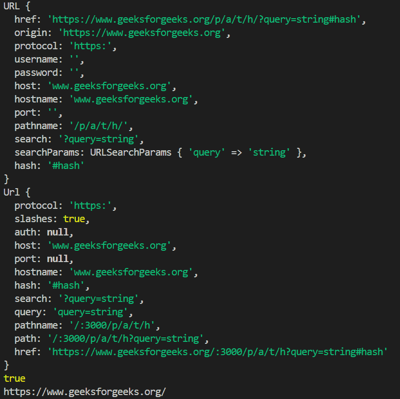

# Node.js URL() Method

The URL() constructor in Node.js creates a new URL object by parsing a URL string and, when needed, resolving a relative URL against a base. It is part of the built-in url module and provides an organized way to access and work with different parts of a URL, such as the protocol, host, pathname, query string, and hash.

* It can parse both absolute and relative URLs.
* It resolves relative paths using a base URL.
* It helps with tasks like link handling, routing, and API URL processing in Node.js.

Syntax:

```js
new URL(input[, base])
```

where,

input: The absolute or relative URL to parse.
base(optional): The base URL used to resolve relative URLs.

Return Value: It returns the new URL generated along with an array of data like hostname, protocol, pathname, etc.  

Example 1:
```js
// Node.js program to demonstrate the 
// new URL() method 

// Using require to access url module 
const url = require('url');

const newUrl = new URL(
    'https://www.geeksforgeeks.org/p/a/t/h/?query=string#hash');

// url array in JSON Format
console.log(newUrl);

const myUR = url.parse(
    'https://www.geeksforgeeks.org/:3000/p/a/t/h?query=string#hash');
console.log(myUR);
console.log(URL === require('url').URL);

const myURL1 = new URL(
    { toString: () => 'https://www.geeksforgeeks.org/' });

console.log(myURL1.href)
```

Output


Example 2 : 

```js
// Node.js program to demonstrate the 
// new URL() method 

// Using require to access url module 
const url = require('url');
const parseURL = url.parse(
'https://www.geeksforgeeks.org/:3000/p/a/t/h?query=string#hash');

console.log("1 =>", parseURL)

// Prints parsed URL
const newUrl1 = new URL('https://gfg.com');

// prints https://xn--g6w251d/
console.log("2 =>", newUrl1.href)

const myURL = new URL('/alfa',
    'https://akash.org/');
console.log("3 =>", myURL.href)

// https://akash.org/alfa
let newUrl3 = new URL('https://www.gfg.com//',
    'https://gfg.org/');

// Prints https://www.gfg.com//
console.log("4 =>", newUrl3.href)

newUrl4 = new URL('https://Gfg.com/',
    'https://gfg.org/');

// Prints https://gfg.com/
console.log("5 =>", newUrl4.href)

newUrl5 = new URL('foo://Geekyworld.com/',
    'https://geekyworld.org/');
// prints foo://Geekyworld.com/
console.log("6 =>", newUrl5.href)

newUrl6 = new URL('http:Akash.com/',
    'https://akash.org/');
// prints http://akash.com/
console.log("7 =>", newUrl6.href)

newUrl10 = new URL('http:Chota.com/',
    'https://bong.org/');
// prints https://www.bong.com/
console.log("8 =>", newUrl10.href)

newUrl7 = new URL('https:Chota.com/',
    'https://bong.org/');
// prints https://bong.org/Chota.com/
console.log("9 =>", newUrl7.href)

newUrl8 = new URL('foo:ALfa.com/',
    'https://alfa.org/');

// Prints foo:ALfa.com/
console.log("10 =>", newUrl8.href)
```

<strong>Use cases of URL() Method</strong>
- URL Parsing: Extracts different parts of a URL, such as the protocol, hostname, pathname, and query string.
Relative URL Resolution: Converts relative URLs into absolute URLs using a specified base URL.
- Dynamic URL Generation: Creates and modifies URLs programmatically for APIs, redirects, and navigation.
- URL Validation: Verifies whether a URL string is valid by attempting to parse it into a URL object.
- Query Parameter Handling: Simplifies reading, adding, updating, and removing query parameters through the searchParams property.