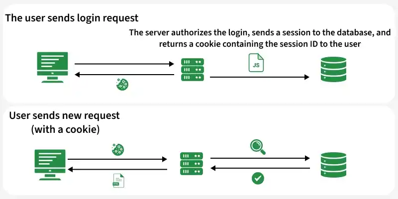

# Session Variables with Node.js

Session variables in Node.js are used to store user-specific data on the server during a user’s interaction with a web application, typically managed using middleware like express-session.

Store user data (e.g., login status, user ID) across multiple requests.
Maintained on the server and linked to the client via a session ID.
Commonly implemented using middleware such as express-session.Session Variables with Node.js



<details>
    <summary><strong>Role of Session Variables in Web Applications</strong></summary>
    
Session variables are used to store user-specific data on the server so it can be accessed across multiple requests during a user’s session.

- User Authentication: Store authentication details such as user ID or login status.
- Data Persistence: Retain important information between requests without requiring repeated input from the user.
- Improved User Experience: Maintain user activity and preferences for a smooth and continuous interaction.

<details>
    <summary><strong>Implementing Session Variables in Node.js</strong></summary>
    
Session variables allow you to store user-specific data on the server and maintain state across multiple requests.

Setting Up Session Variables

To use session variables in Node.js, you need to install and configure session middleware. A commonly used middleware is express-session.

Step 1: Initialize the project

Run the following command in the terminal:
```bash
npm init -y
```
Step 2: Install required modules

Run the following command:
```bash
npm install express express-session cookie-parser
```
</details>

---

<details>
    <summary><strong>Using Session Variable in Node.js</strong></summary>
    
This example demonstrates how session variables track the number of times a user visits a website.

- A unique session is created when the user visits the site for the first time.
- A session ID is stored in a cookie to identify the user on subsequent visits.
- The server updates and maintains a view counter using session data.

```js
const express = require("express");
const session = require("express-session");
const cookieParser = require("cookie-parser");
const PORT = 4000;

const app = express();

app.use(cookieParser());

app.use(session({
    secret: "amar",
    saveUninitialized: true,
    resave: true
}));

app.get('/', (req, res) => {
    if (req.session.view) {
        req.session.view++;
        res.send("You visited this page for " 
            + req.session.view + " times");
    }
    else {
        req.session.view = 1;
        res.send("You have visited this page"
           + " for first time ! Welcome....");
    }
})

app.listen(PORT, () =>
    console.log(`Server running at ${PORT}`));
```
Output: The number of times you visit the same page, the number of times the counter will increase.


- The server uses express, express-session, and cookie-parser to manage sessions on port 4000.
- express-session creates and stores session data, while cookieParser parses incoming cookies.
- The session variable view is initialized on the first visit and incremented on subsequent visits.
</details>

---
<details>
    <summary><strong>Creating Login and Log out with session variables</strong></summary>
    
This example demonstrates session-based authentication.

- The user cannot access the profile until logge in.
- When the user logs in, session data is created and stored.
- When the user logs out, the session is destroyed.

```js
const express = require("express");
const app = express();
const session = require("express-session");
const cookieParser = require("cookie-parser");
const PORT = 4000;

app.use(cookieParser());

app.use(session({
    secret: "amar",
    saveUninitialized: true,
    resave: true
}));

const user = {
    name: "Amar",
    Roll_number: 43,
    Address: "Pune"
};

app.get("/login", (req, res) => {
    req.session.user = user;
    req.session.save();
    return res.send("Your are logged in");
});

app.get("/user", (req, res) => {
    const sessionuser = req.session.user;
    res.send(sessionuser);
});

app.get("/logout", (req, res) => {
    req.session.destroy();
    res.send("Your are logged out ");
});

app.listen(PORT, () => console.log(`Server at ${PORT}`));
```
</details>
</details>

---

<details>
    <summary><strong>Best Practices</strong></summary>
    
Follow security and scalability best practices when managing session variables in Node.js applications.

- Use Secure Cookies: Enable secure: true in production with HTTPS.
- Session Expiration: Configure appropriate session timeout for security.
- Encrypt Session Data: Encrypt sensitive information before storing it.
- Use Persistent Store: Prefer Redis or MongoDB over in-memory storage for scalability.
- Avoid Sensitive Data: Do not store passwords keep only essential identifiers or tokens.
</details>