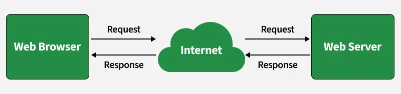
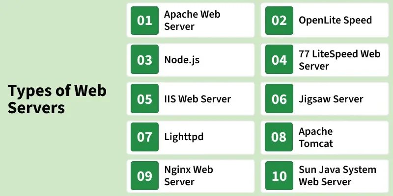

# Introduction to Web Server

System that stores and delivers web content to users over the internet is known as a web server, which primarily uses HTTP or HTTPS protocols. An HTTP server specifically focuses on handling HTTP requests and responses between the client and the server.

- Responds to browser requests by serving web resources.
- HTTP server is a type of web server focused on HTTP communication.
- Some web servers support additional protocols beyond HTTP.

    
<strong>Working</strong>

When a user enters a URL, the browser sends an HTTP request to the web server, which processes it and returns the required resources to display the page.

- Client Request: In the web browser (https://www.geeksforgeeks.org/), the user enters a URL.
DNS Resolution: The browser contacts a DNS server to obtain the IP address of the requested domain.
- Establishing Connection: Using the obtained IP address, the browser establishes a connection with the web server through TCP (and TLS in case of HTTPS).
- Sending HTTP Request: The browser sends an HTTP request (with headers and method like GET/POST) to the server.
- Processing Request: The web server receives the request, processes it, and may interact with backend services or databases.
- Serving the Response: The server sends back a response containing status codes and requested files (HTML, CSS, JavaScript, images).
- Rendering the Web Page: Based on the received data, the browser parses, executes scripts, and displays the web page to the user.

---

    
<strong>Types</strong>

    
Web servers can be categorized based on their functionality, usage, and implementation. Below are some of the most common types:

    
<strong>1. Apache Web Server</strong>

    
Apache Web Server is a widely used open-source web server developed by the Apache Software Foundation. Released in 1995, it is written in C, highly customizable, and distributed under the Apache License 2.0.

- Supports multiple operating systems (Windows, Linux, macOS).
- Allows advanced routing.
- Provides directory-level configuration.

---

    
<strong>2. Nginx Web Server</strong>

Nginx (pronounced “Engine-X”) is a high-performance web server known for speed, scalability, and efficient handling of concurrent connections. Developed by Igor Sysoev and released in 2004, it is written in C.

- Designed to handle high traffic efficiently and serve static content.
- Functions as a reverse proxy and load balancer.

---

    
<strong>3. Microsoft IIS (Internet Information Services)</strong>

    
IIS is a web server developed by Microsoft, designed to work with Windows Server environments. It was developed by Microsoft, and first released in 1995 as a web server designed specifically for Windows-based systems. It is written in C++.

- Supports ASP.NET, PHP, and other web technologies.
- Provides built-in security features.
- Integrates well with Microsoft products.

---

    
<strong>4. LiteSpeed Web Server</strong>

    
LiteSpeed is a high-performance web server known for its speed and security features. The LiteSpeed Web Server, developed by LiteSpeed Technologies, and first introduced in 2003 as a high-performance alternative to Apache. It is written in C.

- Faster processing than Apache in some scenarios.
- Built-in DDoS protection.
- Supports PHP applications with high efficiency.

---

    
<strong>5. Apache Tomcat Web Server</strong>

    
Apache Tomcat is a web server used to run Java-based applications. Developed by the Apache Software Foundation and released in 1998, it is written in Java and works well with frameworks like Spring Boot.

- Supports Java Servlets and JSP, providing a strong environment for Java-based applications.
- Integrates well with the Apache web server for enhanced performance and scalability.

---

    
<strong>6. NodeJS Web Server</strong>

Node.js can act as a web server by directly handling HTTP requests. Developed by Ryan Dahl in 2009, it is a JavaScript runtime built on Chrome’s V8 engine and primarily written in C/C++, allowing JavaScript to run on the server side.

- Event-driven, non-blocking architecture.
- Highly efficient for real-time applications.
- Uses JavaScript for both client-side and server-side development.

---

    
<strong>7. Lighttpd</strong>

    
Lighttpd is a lightweight, fast web server developed by Jan Kneschke and released in 2003. Written in C, it is open source under the BSD License and runs on Windows, Linux, and macOS.

- It is optimized for low memory usage and high-speed performance, making it ideal for servers with limited resources.
- Uses asynchronous request handling, which improves efficiency and scalability for handling multiple connections.
- Supports HTTPS, FastCGI, and URL rewriting, making it a secure and efficient choice for web hosting.

---

    
<strong>8. OpenLiteSpeed</strong>

    
OpenLiteSpeed is an open-source web server by LiteSpeed Technologies, released in 2013. Written in C and licensed under GPLv3, it supports caching, HTTP/3, and high performance across Windows, Linux, and macOS.

- Delivers fast processing with built-in caching.
- Uses an event-driven architecture to improve performance.
- Supports modern web protocols for secure communication.
- Provides an easy-to-use interface for server configuration.

---

    
<strong>9. Jigsaw Server</strong>

    
Jigsaw Server is an open-source, Java-based web server developed by the W3C and released in 1996. It is mainly used for testing and developing web standards rather than production hosting.

- Jigsaw is cross-platform, running on Windows, Linux, and macOS.
- Allows users to extend and modify its functionality easily, making it flexible for research and development.
- Fully supports HTTP/1.1 and is designed for experimenting with new web technologies.

---

    
<strong>10. Sun Java System Web Server</strong>

The Sun Java System Web Server was developed by Sun Microsystems in 1996 for Java applications. Written in C and C++, it was later discontinued after Oracle acquired Sun Microsystems.

- Designed specifically for hosting Java-based enterprise applications, ensuring seamless integration.
- Handles high traffic efficiently, making it suitable for large-scale applications.
- Supports multiple operating systems, including Windows, Linux, and Solaris, for flexible deployment.

---
 

     
<strong>Web Servers and Their Use Cases</strong>

     
Choosing the right web server depends on what you need for your website or application. Here’s a simple guide to help you decide:

- Apache: Reliable and customizable for general-purpose websites.
- Nginx: High-performance server for heavy traffic.
- IIS: Best for Windows and ASP.NET applications.
- LiteSpeed: Faster, secure alternative to Apache for PHP/WordPress.
- Apache Tomcat: Ideal for Java Servlets and JSP applications.
- Node.js: Suited for real-time apps using JavaScript.
- Lighttpd: Lightweight server for low-resource systems.
- Jigsaw: Used for testing and researching web standards.
 
