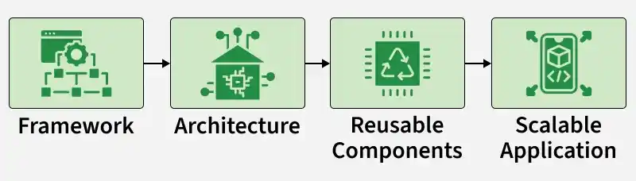
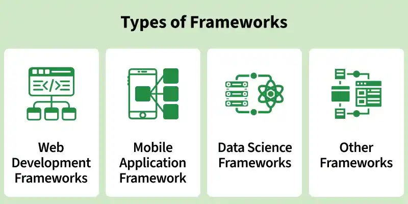

# Introduction to Frameworks

A framework is a structured foundation that simplifies development by providing predefined architecture and reusable components, making applications easier to build, maintain, and scale.

- Reduces errors and code redundancy by promoting clean and organized code.
- Saves development time and cost with built-in tools and features.
- Allows customization and extension of functionalities as per project requirements.

    
<strong>Types of Frameworks</strong>

Before starting development, you must choose the right programming language and framework based on your project requirements, scalability needs, and features.

- Select a programming language suitable for your project.
- Research frameworks within that language (e.g., Angular, Next.js, Vue.js for JavaScript).
- Compare features, performance, and community support.
- Clearly define requirements before finalizing the framework.

---

    
<strong>Web Development Frameworks</strong>

Web development focuses on building and maintaining websites and web applications, including static, dynamic, and single-page applications. Web development frameworks provide essential tools, services, and APIs, and are mainly categorized into Front-end and Back-end frameworks.

    
<strong>1. Front-End Frameworks</strong>

Frontend web development frameworks are used to create the user interface of the website that is seen and used by the users. They develop the client side of the application. Some of the popular front-end web development frameworks are Angular and Vue.js.

    
<strong>Angular</strong>

Angular is an open-source TypeScript-based web framework developed by Google for building dynamic, scalable web applications and Progressive Web Apps (PWAs).

- Built with TypeScript and follows a component-based architecture.
- Provides high performance, strong tooling, and easy third-party integration.
- Used by major companies like Google, PayPal, Nike, and Upwork.

---

    
<strong>VueJS</strong>

Vue.js is an open-source JavaScript frontend framework used for building interactive and dynamic user interfaces using HTML, CSS, and JavaScript.

- Follows the MVVM architecture and is easy to learn with strong community support.
- Used by companies such as Behance and Trustpilot.

---

    
<strong>Bootstrap</strong>

Bootstrap is an open-source CSS framework used for developing responsive and mobile-first websites using HTML, CSS, and JavaScript.

- Enables fast, responsive, and cross-platform web development.
- Used by leading companies such as Airbnb, Netflix, and Uber.

---

    
<strong>2. Back-End Frameworks</strong>

    
Backend web development frameworks operate on the server side and handle tasks such as processing requests, managing databases, and interacting with APIs. Popular examples include Ruby on Rails, Django, and PHP frameworks.

    
<strong>Ruby on Rails</strong>

    
Ruby on Rails is an open-source Ruby-based web framework that follows the MVC architecture to build secure, scalable, and maintainable web applications.

- Based on the Model-View-Controller (MVC) architecture with support for third-party libraries.
- Used by companies such as CafePress and Airbnb.

---

    
<strong>Django</strong>

Django is an open-source Python-based web framework designed for rapid development of secure, scalable, and maintainable web applications.

- Follows the Model-Template-View (MTV) architecture.
- Supports rapid development with built-in features like authentication and admin panel.
- Used by companies such as YouTube, Instagram, and Spotify.

---

    
<strong>Spring Boot</strong>

Spring Boot is an open-source Java-based framework used to build production-ready, standalone, and scalable web applications.

- Simplifies application setup with auto-configuration and embedded servers.
- Provides high flexibility and scalability for enterprise applications.

---

    
<strong>Mobile Application Framework</strong>

Mobile application frameworks are used to build apps for Android and iOS, supporting native, hybrid, and cross-platform development. Popular frameworks include Flutter, React Native, and Ionic.

    
<strong>Flutter</strong>

Flutter is an open-source UI framework developed by Google for building cross-platform applications using the Dart programming language.

- Creates apps for Android, iOS, Web, and Desktop from a single codebase.
- Uses a widget-based architecture for fast and expressive UI development.
- Used by companies such as Google, Microsoft, Amazon, eBay, and Adobe.

    
<strong>React Native</strong>

    
React Native is an open-source JavaScript framework developed by Meta for building cross-platform mobile and desktop applications using a single codebase.

- Supports Android, iOS, macOS, Web, and Windows platforms.
- Enables reusable components and faster development with JavaScript and React.

---

    
<strong>Data Science Frameworks</strong>

Data Science is a field that collects data from various sources and then analyses them by applying various algorithms and statistics. Majorly, data scientists work with Python language hence many Python frameworks are used in data science:

    
<strong>PyTorch</strong>

PyTorch is an open-source Python-based deep learning framework built on the Torch library for developing machine learning models.

- Used for building neural networks and deep learning models.
- Applied in NLP, image classification, and object detection tasks.

---

    
<strong>Apache Spark</strong>

Apache Spark is an open-source big data processing framework used for large-scale data analytics and real-time data processing.

- Supports multiple languages including Scala, Python, Java, and R.
- Used for machine learning, real-time stream processing, and predictive analytics.

---

    
<strong>Other Frameworks</strong>

Specialized frameworks target specific domains like gaming, machine learning, desktop, and API development.

    
<strong>Game Development</strong>

    
- Unity: Unity used for developing 2D/3D games and VR experiences for mobile, PC, and consoles, adopted by companies like Ubisoft and Niantic.
- Unreal Engine: Unreal Engine used for creating AAA games, VR applications, and simulations, utilized by Epic Games and Square Enix.

---

    
<strong>Machine Learning</strong>

- TensorFlow: TensorFlow is used for building and deploying machine learning models for tasks such as image recognition and NLP, and is used by companies like Google and Airbnb.
- Scikit-learn: Scikit-learn is used for data analysis and machine learning tasks such as classification and regression.

---

    
<strong>Desktop Application Development</strong>

    
- Electron: Electron is used for building cross-platform desktop applications and powers apps like Visual Studio Code and Slack.
- Qt: Qt is used for developing high-performance desktop, embedded, and mobile applications with native interfaces, and is used by companies like Autodesk.

---

    
<strong>API Development</strong>

- FastAPI: FastAPI is used for building high-performance APIs with automatic data validation and is used by companies like Microsoft and Uber.
- Express.js: Express.js is used for developing RESTful APIs and web applications and is used by companies like Twitter and Accenture.

---

    
<strong>Libraries Vs Frameworks</strong>

    
Libraries provide specific reusable functionality, while frameworks offer a complete structured environment for building applications.

| Library | Framework |
| -------- | -------- |
| A collection of reusable functions or components for a specific task.   | A complete development structure with tools, libraries, and predefined architecture.   |
| Focuses on a particular functionality. | Covers the overall application development process. |
| Developer controls when and how to call it. | Controls the application flow and calls the developer’s code. |
| May be used independently or within a framework. | Often includes multiple libraries and tools. |

