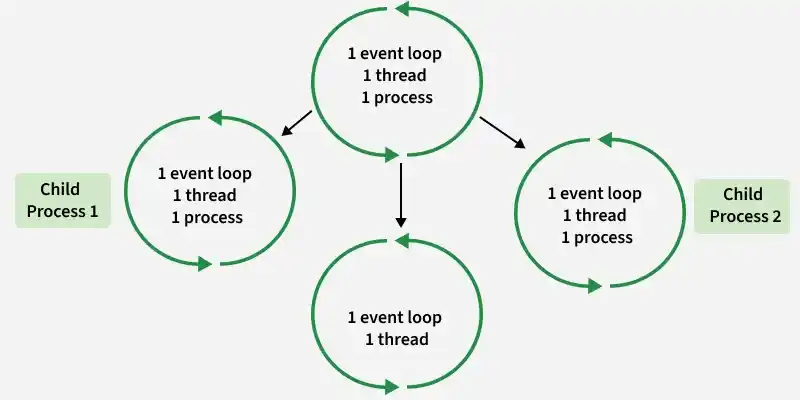
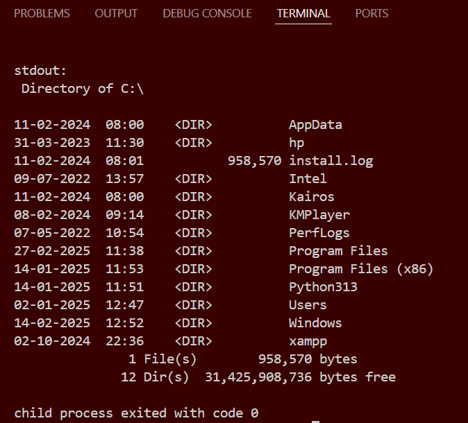
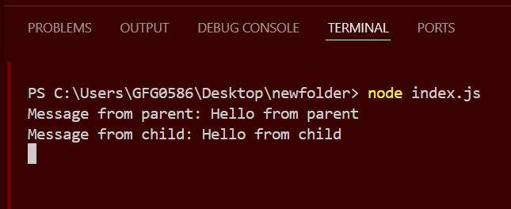
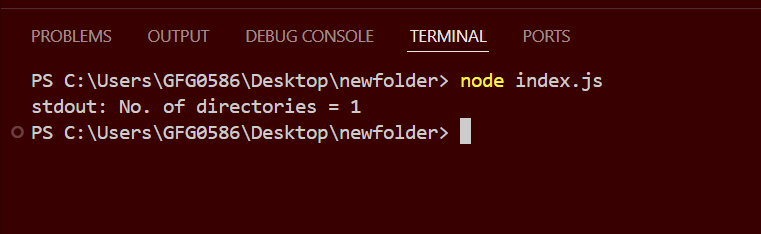

# Node Child Process

Node.js is single-threaded but uses the child_process module to create separate processes for executing external commands or heavy tasks without blocking the main event loop.

- Executes external scripts such as Python, Bash, or other Node.js files.
- Enables parallel execution by creating multiple child processes.

The child_process module provides four methods to create child processes:

- spawn: Starts a new process and streams data between parent and child.
- exec: Executes a command in a shell and buffers the output.
- execFile: Runs an executable file directly without using a shell.
- fork: Creates a Node.js child process with built-in message communication.



<details>
    <summary><strong>Methods to Create Child Processes</strong></summary>
    
The child_process module provides multiple methods to create and manage child processes for executing external commands and parallel tasks in Node.js.

<details>
    <summary><strong>1. spawn() method</strong></summary>

The spawn() method launches a new process with a specified command and arguments, providing streams for input/output. It's ideal for handling large outputs or long-running processes.

```js
const { spawn } = require('child_process');
const child = spawn('ls', ['-lh', '/usr']);

child.stdout.on('data', (data) => {
    console.log(`stdout: ${data}`);
});

child.stderr.on('data', (data) => {
    console.error(`stderr: ${data}`);
});

child.on('close', (code) => {
    console.log(`child process exited with code ${code}`);
});
```

Output



- spawn('ls', ['-lh', '/usr']): Executes the ls command with -lh and /usr as arguments.
- child.stdout.on('data', ...): Listens for data from the standard output.
- child.stderr.on('data', ...): Listens for data from the standard error.
- child.on('close', ...): Listens for the close event, indicating the process has finished.    
</details>

---

<details>
    <summary><strong>2. fork() method</strong></summary>
    
The fork() method is a special case of spawn() used specifically for spawning new Node.js processes. It establishes an IPC (Inter-Process Communication) channel between the parent and child processes, allowing them to communicate via message passing.

```js
const { fork } = require('child_process');

const child = fork('child.js');

child.on('message', (message) => {
  console.log(`Message from child: ${message}`);
});

child.send('Hello from parent');

// Child.js

// Listen for messages from the parent process
process.on('message', (message) => {
  console.log(`Message from parent: ${message}`);

  // Send a response back to the parent
  process.send('Hello from child');
});
```


- fork('child.js'): Spawns a new Node.js process running the child.js module.
- child.on('message', ...): Listens for messages from the child process.
- child.send('Hello from parent'): Sends a message to the child process.
</details>

---

<details>
    <summary><strong>3. exec() method</strong></summary>
    
The exec() method runs a command in a shell and buffers the output, which is suitable for short-lived commands with small outputs.

```js
const { exec } = require('child_process');

// Counts the number of directory in
// current working directory
exec('dir | find /c /v ""', (error, stdout, stderr) => {
    if (error) {
        console.error(`exec error: ${error}`);
        return;
    }
    console.log(`stdout: No. of directories = ${stdout}`);
    if (stderr != "")
        console.error(`stderr: ${stderr}`);
});

// child_process
const child = spawn('cmd', ['/c', 'dir']);
```


- exec('ls -lh /usr', ...): Executes the ls command with -lh and /usr as arguments.
- The callback receives error, stdout, and stderr as parameters.
- Logs the standard output and error to the console.
</details>

---

<details>
    <summary><strong>4. execFile() method</strong></summary>
    
The execFile() method runs an executable file directly without spawning a shell, making it more efficient than exec() for running binaries and scripts directly.

```js
const { execFile } = require('child_process');

execFile('node', ['--version'], (error, stdout, stderr) => {
    if (error) {
        console.error(`execFile error: ${error}`);
        return;
    }
    console.log(`stdout: ${stdout}`);
    if (stderr) {
        console.error(`stderr: ${stderr}`);
    }
});
```

- execFile('node', ['--version'], ...): Executes the Node.js binary with the --version flag.
- The callback receives error, stdout, and stderr as parameters.
- Logs the standard output and error to the console.
</details>

---

<details>
    <summary><strong>Comparison of exec, execFile, spawn, and fork</strong></summary>
    
| exec() | execFile() | spawn() | fork() | 
| -------- | -------- | --------| -------|
| Uses shell and buffers output   | Runs file directly without shell and buffers output | Uses shell and streams output | Creates Node.js process with message communication | 
| No streaming | No streaming | Supports streaming | Supports IPC (message passing) |
| Best for small shell commands | Best for running binary files | Best for large outputs | Best for Node.js child processes |

</details>

---

<details>
    <summary><strong>Best Practices for Using Child Processes</strong></summary>
    
- Use exec() for simple shell commands (when output size is small).
- Use execFile() for executing binary files (faster & safer).
- Use spawn() for handling large data or real-time output streaming.
- Use fork() for multi-processing and parallel execution in Node.js.
- Always handle errors properly (use stderr and error events).
- Use asynchronous methods whenever possible to avoid blocking the event loop.
</details>

</details>

