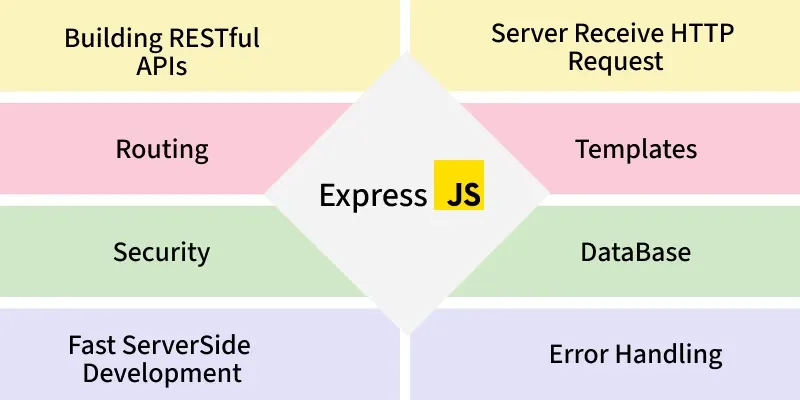
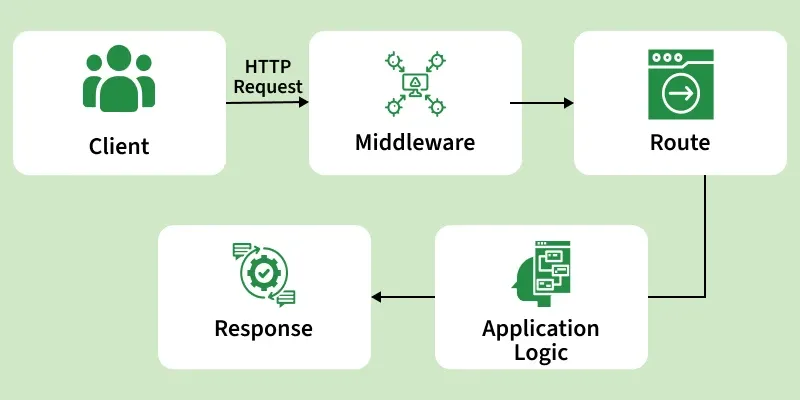

# Introduction to Express

Express.js is a minimal and flexible Node.js web application framework that simplifies building server-side applications and APIs.



- Middleware-based: Uses middleware to handle requests, responses, and common features.
- Routing system: Structure—developers can design apps as they want.
- Integration: Works well with databases (MongoDB, MySQL, PostgreSQL) and front-end frameworks.
- Scalable: Suitable for small apps to large-scale enterprise APIs.

<details>
    <summary><strong>"Hello World" Example</strong></summary>
    
Create a simple "Hello World" application with Express.

```js
const express = require('express');
const app = express();
const PORT = 3000;

app.get('/', (req, res) => {
    res.send('Hello, Geeks!');
});

app.listen(PORT, () => {
    console.log(`Server is listening at http://localhost:${PORT}`);
});
```

Start the Server:

Run your server with the following command
```
node server.js
```

Web Browser Output
When you navigate to http://localhost:3000 in your web browser, you should see:


</details>

---

<details>
    <summary><strong>Working of Express</strong></summary>
    
Express.js works by handling client requests through a series of steps called the request-response cycle, using middleware and routing to process requests and send responses efficiently.



- A client sends a request (e.g., browser or app) to the Express server.
- The request flows through middleware that handles logging, authentication, and other processing tasks.
- Express matches the request to a route handler based on the URL and HTTP method.
- The route handler processes the request and prepares a response.
- The server sends the response back to the client.
- If any error occurs, it is caught by error-handling middleware to ensure the server remains stable.
</details>

---

<details>
    <summary><strong>Basic Routing in Express.js</strong></summary>
    
Basic routing in Express.js is the process of defining URL endpoints (routes) and specifying how the server should respond to client requests at those endpoints.

Express provides simple methods to define routes that correspond to HTTP methods:

- app.get() - Handle GET requests.
- app.post() - Handle POST requests.
- app.put() - Handle PUT requests.
- app.delete() - Handle DELETE requests.
- app.all() - Handle all HTTP methods.

```js
const express = require('express');
const app = express();
const PORT = 3000;

// Middleware to parse JSON bodies
app.use(express.json());

// Basic Routing Examples

// Handle GET requests
app.get('/get-example', (req, res) => {
  res.send('This is a GET request');
});

// Handle POST requests
app.post('/post-example', (req, res) => {
  res.send('This is a POST request');
});

// Handle PUT requests
app.put('/put-example', (req, res) => {
  res.send('This is a PUT request');
});

// Handle DELETE requests
app.delete('/delete-example', (req, res) => {
  res.send('This is a DELETE request');
});

// Handle all HTTP methods
app.all('/all-example', (req, res) => {
  res.send(`This handles all HTTP methods: ${req.method}`);
});

// Start the server
app.listen(PORT, () => {
  console.log(`Server is running on http://localhost:${PORT}`);
});
```

- The server handles different HTTP requests using routes (GET, POST, PUT, DELETE, ALL).
- Each route sends a response when its specific URL is accessed.
- The program does not block and can handle multiple requests efficiently.
- The server starts and listens on port 3000.
</details>

---

<details>
    <summary><strong>Parameters in Express.js</strong></summary>
    
Parameters in Express.js are values that are passed in the URL or request that your server can use to process the request dynamically. They allow your routes to handle different inputs without creating multiple static routes.

<details>
    <summary><strong>Types of Parameters in Express:</strong></summary>
    
<details>
    <summary><strong>1. Route Parameters: Part of the URL (e.g., /users/:id) accessed via req.params.</strong></summary>
    
```js
app.get('/users/:id', (req, res) => {
  const userId = req.params.id;
  res.send(`User ID is ${userId}`);
});
```
</details>

---

<details>
    <summary><strong>2. Query Parameters: Appended to the URL (e.g., /search?term=nodejs) accessed via req.query.</strong></summary>
    
```js
app.get('/search', (req, res) => {
  const searchTerm = req.query.term;
  res.send(`Searching for ${searchTerm}`);
});
```
</details>

---

<details>
    <summary><strong>3. Request Body Parameters: Sent in POST or PUT requests, accessed via req.body with express.json() middleware.</strong></summary>
    
```js
app.use(express.json());

app.post('/users', (req, res) => {
  const { name, age } = req.body;
  res.send(`User created: ${name}, Age: ${age}`);
});
```
</details>

</details>
</details>

--- 

<details>
    <summary><strong>Middleware in Express.js</strong></summary>
    
Middleware in Express.js is a function that executes during the request-response cycle. It has access to the request (req) and response (res) objects, and can either end the request-response process or pass control to the next middleware using next().

Middleware is used for

Logging requests
- Authentication and authorization
- Parsing request bodies
- Handling errors
- Built-in Middleware

Express includes several useful middleware functions:

- express.json() - Parse JSON request bodies
- express.urlencoded() - Parse URL-encoded request bodies
- express.static() - Serve static files
- express.Router() - Create modular route handlers

```js
const express = require('express');
const app = express();
const PORT = 3000;

// Middleware to log requests
app.use((req, res, next) => {
  console.log(`${req.method} request for ${req.url}`);
  next(); // Pass control to the next middleware/route
});

// Middleware to parse JSON bodies
app.use(express.json());

// Route handler
app.get('/', (req, res) => {
  res.send('Hello, Express with middleware!');
});

app.listen(PORT, () => {
  console.log(`Server running on http://localhost:${PORT}`);
});
```

- Middleware logs each request method and URL before handling it.
- next() passes control to the next middleware or route.
- JSON middleware parses incoming request data.
- The route / sends a response to the client.
- The server runs on port 3000.
</details>

---

<details>
    <summary><strong>Error Handling in Express.js</strong></summary>
    
Error handling in Express is done through special middleware functions that have four arguments:

(err, req, res, next).

```js
const express = require('express');
const app = express();
const PORT = 3000;

// Middleware to simulate an error
app.get('/error', (req, res, next) => {
  const err = new Error('Something went wrong!');
  err.status = 500;
  next(err); // Pass error to error-handling middleware
});

// Error-handling middleware
app.use((err, req, res, next) => {
  console.error(err.stack); // Log the error
  res.status(err.status || 500).send({
    message: err.message,
    status: err.status || 500
  });
});

app.listen(PORT, () => {
  console.log(`Server running on http://localhost:${PORT}`);
});

```

- The /error route creates and passes an error using next(err).
- Error-handling middleware catches and handles the error.
- The error is logged using console.error().
- A response with error message and status is sent to the client.
- The server runs on port 3000.
</details>

---

<details>
    <summary><strong>Usage of Express.js</strong></summary>
    
Express.js is a popular web framework for Node.js that simplifies server-side development. It is widely used to build web applications, APIs, and scalable server-side solutions.

- Web Applications: Build dynamic sites and SPAs efficiently.
- RESTful APIs: Create APIs for CRUD operations and data delivery.
- Middleware Apps: Add logging, authentication, and validation.
- Microservices: Lightweight and modular for scalable services.
- Server-Side Rendering: Supports EJS, Pug, Handlebars.
- Proxy/Gateway: Routes and manages HTTP traffic.
- Rapid Prototyping: Quickly develop and test server logic.
</details>

