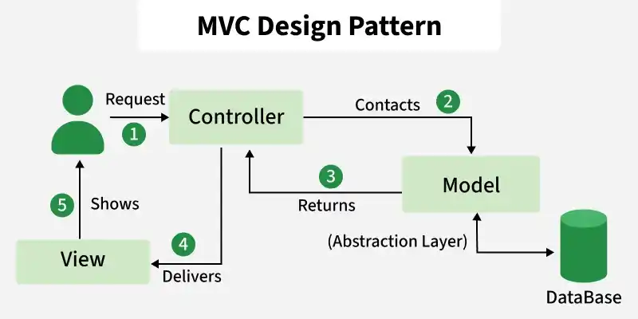
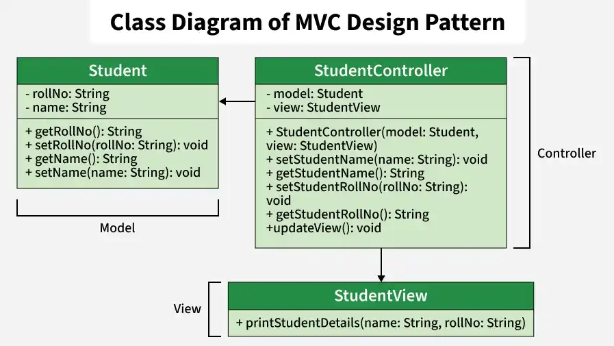

# MVC Design Pattern

The MVC (Model–View–Controller) design pattern divides an application into three separate components: Model, View, and Controller. This separation of concerns improves code organization, maintainability, and scalability. Each component handles a specific responsibility, making the application easier to modify and extend.

- Model: Manages application data and business logic.
- View: Handles the user interface and presentation of data.
- Controller: Processes user input and coordinates between Model and View.

<details>
    <summary><strong>Components</strong></summary>
    
The MVC architecture consists of three main components that work together to separate application logic, data handling, and user interaction.



<details>
    <summary><strong>1. Model</strong></summary>
    
The Model component in the MVC (Model-View-Controller) design pattern demonstrates the data and business logic of an application. It is responsible for managing the application's data, processing business rules, and responding to requests for information from other components, such as the View and the Controller.
</details>

---

<details>
    <summary><strong>2. View</strong></summary>
    
Displays the data from the Model to the user and sends user inputs to the Controller. It is passive and does not directly interact with the Model. Instead, it receives data from the Model and sends user inputs to the Controller for processing.
</details>

---

<details>
    <summary><strong>3. Controller</strong></summary>
    
Controller acts as an intermediary between the Model and the View. It handles user input and updates the Model accordingly and updates the View to reflect changes in the Model. It contains application logic, such as input validation and data transformation.
</details>

---

<details>
    <summary><strong>Real-Life Software Example</strong></summary>
    
An e-commerce website follows the MVC pattern to separate data handling, user interface, and request processing.

- Model: Manages product data, user accounts, and order information from the database.
- View: Displays product pages, shopping carts, and order details to users.
- Controller: Handles user requests, processes actions like login or checkout, and updates the Model and View accordingly.
</details>

---

<details>
    <summary><strong>Uses</strong></summary>
    
MVC is used to organize an application by separating responsibilities, making development and maintenance easier.

- Allows independent development and modification of Model, View, and Controller.
- Improves maintainability by isolating changes to specific components.
- Simplifies testing by separating business logic from the user interface.
- Supports scalability and smoother addition of new features.
</details>

</details>

---

<details>
    <summary><strong>Communication between the Components</strong></summary>
    
This below communication flow ensures that each component is responsible for a specific aspect of the application's functionality, leading to a more maintainable and scalable architecture

- User Interaction with View: The user interacts with the View, such as clicking a button or entering text into a form.
- View Receives User Input: The View receives the user input and forwards it to the Controller.
- Controller Processes User Input: The Controller receives the user input from the View. It interprets the input, performs any necessary operations (such as updating the Model), and decides how to respond.
- Controller Updates Model: The Controller updates the Model based on the user input or application logic.
- Model Notifies View of Changes: If the Model changes, it notifies the View.
- View Requests Data from Model: The View requests data from the Model to update its display.
- Controller Updates View: The Controller updates the View based on the changes in the Model or in response to user input.
- View Renders Updated UI: The View renders the updated UI based on the changes made by the Controller.
</details>

---

<details>
    <summary><strong>Implementation Example</strong></summary>
    
Problem Statement

Design and implement a student management application using the MVC (Model–View–Controller) design pattern. The Model manages student data such as name and roll number, the View displays the information, and the Controller handles updates and coordinates communication between the Model and View.



Let’s break down into the component wise code.

<details>
    <summary><strong>1. Model (Student class)</strong></summary>
    
Represents the data (student's name and roll number) and provides methods to access and modify this data.

```js
class Student {
    constructor() {
        this._rollNo = "";
        this._name = "";
    }

    getRollNo() {
        return this._rollNo;
    }

    setRollNo(rollNo) {
        this._rollNo = rollNo;
    }

    getName() {
        return this._name;
    }

    setName(name) {
        this._name = name;
    }
}
```
</details>

---
<details>
    <summary><strong>2. View (StudentView class)</strong></summary>
    
Represents how the data (student details) should be displayed to the user. Contains a method (printStudentDetails) to print the student's name and roll number.

```js
class StudentView {
    printStudentDetails(studentName, studentRollNo) {
        console.log('Student:');\n        console.log('Name: ' + studentName);\n        console.log('Roll No:'+ studentRollNo);
    }
}
```
</details>

---
<details>
    <summary><strong>3. Controller (StudentController class)</strong></summary>
    
Acts as an intermediary between the Model and the View. Contains references to the Model and View objects. Provides methods to update the Model (e.g., setStudentName, setStudentRollNo) and to update the View (updateView).

```js
class Student {
    constructor() {
        this.name = "";
        this.rollNo = "";
    }
    setName(name) {
        this.name = name;
    }
    getName() {
        return this.name;
    }
    setRollNo(rollNo) {
        this.rollNo = rollNo;
    }
    getRollNo() {
        return this.rollNo;
    }
}

class StudentView {
    printStudentDetails(name, rollNo) {
        console.log(`Student: ${name}, Roll No: ${rollNo}`);
    }
}

class StudentController {
    constructor(model, view) {
        this.model = model;
        this.view = view;
    }
    setStudentName(name) {
        this.model.setName(name);
    }
    getStudentName() {
        return this.model.getName();
    }
    setStudentRollNo(rollNo) {
        this.model.setRollNo(rollNo);
    }
    getStudentRollNo() {
        return this.model.getRollNo();
    }
    updateView() {
        this.view.printStudentDetails(this.model.getName(), this.model.getRollNo());
    }
}
```
</details>

---
<details>
    <summary><strong>Complete code for the above example</strong></summary>
    
The complete code for the above example is.

```js
class Student {
    constructor() {
        this._rollNo = null;
        this._name = null;
    }

    get rollNo() {
        return this._rollNo;
    }

    set rollNo(rollNo) {
        this._rollNo = rollNo;
    }

    get name() {
        return this._name;
    }

    set name(name) {
        this._name = name;
    }
}

class StudentView {
    printStudentDetails(studentName, studentRollNo) {
        console.log('Student:')
        console.log('Name:'+ studentName);
        console.log('Roll No:'+ studentRollNo);
    }
}

class StudentController {
    constructor(model, view) {
        this.model = model;
        this.view = view;
    }

    setStudentName(name) {
        this.model.name = name;
    }

    getStudentName() {
        return this.model.name;
    }

    setStudentRollNo(rollNo) {
        this.model.rollNo = rollNo;
    }

    getStudentRollNo() {
        return this.model.rollNo;
    }

    updateView() {
        this.view.printStudentDetails(this.model.name, this.model.rollNo);
    }
}

function retriveStudentFromDatabase() {
    let student = new Student();
    student.name = 'Lokesh Sharma';
    student.rollNo = '15UCS157';
    return student;
}

let model = retriveStudentFromDatabase();
let view = new StudentView();
let controller = new StudentController(model, view);
controller.updateView();
controller.setStudentName('Vikram Sharma');
controller.updateView();
```
</details>
</details>
