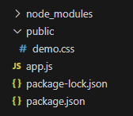

# Serving Static Files in ExpressJS

ExpressJS provides built-in support to serve static assets efficiently, making it easy to deliver files like HTML, CSS, JavaScript, and images to clients.

- Static middleware serves files directly based on URL paths, eliminating the need to define individual routes.
- Simplifies frontend integration with minimal configuration.
- Serves HTML, CSS, JavaScript, and images from the public directory.
- Uses path.join() with __dirname to create a safe, cross-platform absolute path.

Syntax:

```js
app.use(express.static(path.join(__dirname, 'public')));
```

<strong>Steps To Serve Static Files</strong>

To set up an ExpressJS application, follow these structured steps:

Step 1: Create the Project Directory
Open your terminal and create a new directory for your project

```bash
mkdir my-express-app
cd my-express-app
```

Step 2: Initialize the NodeJS Application
Initialize your project and create a package.json file

```bash
npm init -y
```

Step 3: Install ExpressJS
Install ExpressJS as a dependency

```bash
npm install express
```

Step 4: Set Up the Project Structure
Create the main application file and necessary directories

```bash
touch app.js
mkdir public
```
Project Structure



Example : Uses express.static to serve a static CSS file to the Express server

```js
const express = require('express');
const path = require('path');
const app = express();
const PORT = 3000;
// Middleware to serve static files from 'public' directory
app.use(express.static(path.join(__dirname, 'public')));
app.get('/', (req, res) => {
    res.send('Hello Geek');
});
app.listen(PORT, () => {
    console.log(`Server Established at PORT -> ${PORT}`);
});
```

- Initializes an ExpressJS application.
- Serves static files from the public directory.
- Defines a root route (/) sending a response (overridden by index.html).
- Starts the server on port 3000 and logs status.