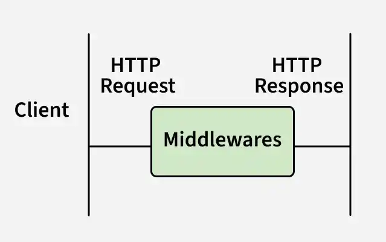
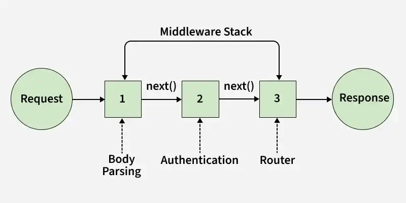

# Middleware in Express

Middleware in Express.js are functions that run during the request–response lifecycle to process requests, modify responses, and control application flow.

- Executes custom logic for each request.
- Can read or modify req and res.
- May send a response and end the cycle.
- Uses next() to pass control to the next middleware.



Syntax:

```js
app.use((req, res, next) => {
    console.log('Middleware executed');
    next();
});
```

(req, res, next) => {}: Middleware function to process the request and response before the final handler.
next(): Passes control to the next middleware if the request–response cycle isn’t ended.

<details>
    <summary><strong>Working of Middleware in Express.js</strong></summary>
    
In Express.js, middleware functions are executed sequentially in the order they are added to the application.

- Request arrives at the server.
- Middleware functions are applied to the request, one by one.
- Each middleware either sends a response or passes control using next().
- If no middleware ends the cycle, the route handler is reached, and a final response is sent.
</details>

---
<details>
    <summary><strong>Types of Middleware</strong></summary>
    
ExpressJS offers different types of middleware and you should choose the middleware based on functionality required.

<details>
    <summary><strong>1. Application-level Middleware</strong></summary>

Application-level middleware runs across the entire Express application, handling common logic for all incoming requests.

- Registered using app.use() or app.METHOD().
- Executes for all routes and HTTP methods.
- Commonly used for logging, authentication, body parsing, and headers.

```js
app.use(express.json()); // Parses JSON data for every incoming request
app.use((req, res, next) => {
  console.log('Request received:', req.method, req.url);
  next();
});
```
</details>

---
<details>
    <summary><strong>2. Router-level Middleware</strong></summary>
    
Router-level middleware applies to a specific router instance, allowing middleware logic to be scoped to a defined group of routes.

- Registered using router.use() or router.METHOD().
- Executes only for routes within that router.
- Ideal for modular route grouping (e.g., auth or user routes).
- Improves code organization and maintainability by isolating middleware to related routes.

```js
const router = express.Router();

// Apply middleware to only this router's routes
router.use((req, res, next) => {
  console.log('Router-specific middleware');
  next();
});

router.get('/dashboard', (req, res) => {
  res.send('Dashboard Page');
});

app.use('/user', router); // The middleware applies only to routes under "/user"
```
</details>

---

<details>
    <summary><strong>3. Error-handling Middleware</strong></summary>
    
Error-handling middleware captures and processes runtime errors during the request–response cycle to ensure stable application behavior.

- Defined with four parameters: err, req, res, next.
- Sends consistent error responses and prevents server crashes.

```js
app.use((err, req, res, next) => {
  console.error(err.stack); // Log the error stack
  res.status(500).send('Something went wrong!');
});
```
</details>

---

<details>
    <summary><strong>4. Built-in Middleware</strong></summary>

Express offers built-in middleware functions to handle common server tasks efficiently.

- express.static() serves static files like images, CSS, and JS.
- express.json() parses incoming JSON request bodies.
```js
app.use(express.static('public')); // Serves static files from the "public" folder
app.use(express.json()); // Parses JSON payloads in incoming requests
```
</details>

---

<details>
    <summary><strong>5. Third-party Middleware</strong></summary>
    
Third-party middleware extends Express applications with additional functionality through npm packages.

- Developed by external contributors and installed via npm.
- Adds features like logging, security, and validation.
- Examples include morgan for request logging and body-parser for parsing request bodies.

```js
const morgan = require('morgan');
app.use(morgan('dev')); // Logs HTTP requests using the "dev" format

const bodyParser = require('body-parser');
app.use(bodyParser.urlencoded({ extended: true })); // Parses URL-encoded bodies
```
</details>
</details>

---

<details>
    <summary><strong>Implement Middleware in Express</strong></summary>

Below are the steps to implement middleware:

Step 1: Initialize the Node.js Project

```bash
npm init -y
```

Step 2: Install the required dependencies

```bash
npm install express
```

Step 3: Set Up the Express Application

```js
// Filename: index.js
const express = require('express');
const app = express();
const port = process.env.PORT || 3000;

app.get('/', (req, res) => {
  res.send('<div><h2>Welcome to GeeksforGeeks</h2><h5>Tutorial on Middleware</h5></div>');
});

app.listen(port, () => {
  console.log(`Listening on port ${port}`);
});
```

Step 4: Start the Application

```bash
node index.js
```

Output:
When you navigate to http://localhost:3000/, you will see:
```
Welcome to GeeksforGeeksTutorial on Middleware
```
</details>

---

<details>
    <summary><strong>Middleware Chaining</strong></summary>
    
Express allows middleware functions to be chained and executed sequentially, processing a request step by step before sending a response.

- Middleware runs in order as a chain.
- Each middleware can process or modify the request.
- The final handler sends the response to the client.
- next() passes control to the next middleware in the chain.



Now let's understand this with the help of example:

```js
const express = require('express');
const app = express();

// Middleware 1: Log request method and URL
app.use((req, res, next) => {
    console.log(`${req.method} request to ${req.url}`);
    next();
});

// Middleware 2: Add a custom header
app.use((req, res, next) => {
    res.setHeader('X-Custom-Header', 'Middleware Chaining Example');
    next();
});

// Route handler
app.get('/', (req, res) => {
    res.send('Hello, World!');
});

app.listen(3000, () => {
    console.log('Server is running on port 3000');
});
```

- Middleware 1: Logs the HTTP method and URL of the incoming request.
- Middleware 2: Sets a custom header X-Custom-Header in the response.
- Route Handler: Sends a "Hello, World!" message as the response.

Output:

When a client makes a GET request to http://localhost:3000/, the server responds with:
```js
Hello, World!
```
</details>