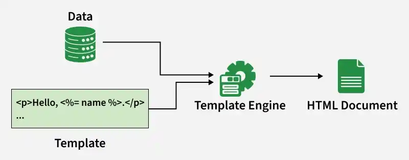
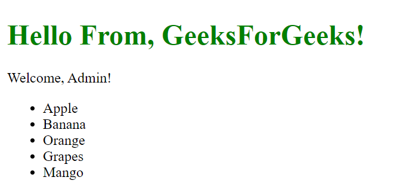

# EJS Template Engine for Express

EJS is a server-side JavaScript template engine for Node.js that enables dynamic HTML generation by embedding JavaScript directly within HTML.

- EJS Stands for Embedded JavaScript.
- It is commonly used with Node.js and Express to render dynamic web pages.
- It allows JavaScript logic to be embedded directly inside HTML templates for generating dynamic content.

<details>
    <summary><strong>Working with EJS Template Engine</strong></summary>
    
EJS is a template engine that allows embedding JavaScript into HTML to generate dynamic web content.

- Uses the .ejs file extension.
- Embeds JavaScript using tags like <% %> and <%= %>.
- Generates dynamic HTML on the server.
- Installed via npm install ejs.



Syntax:

```html
<html>
  <head>
    <title>EJS Syntax Example</title>
  </head>
  <body>
    <!--Using Variable-->
    <h1>Hello, <%= username %>!</h1>
    <!--Conditional Statement -->
    <% if (isAdmin) { %>
    <p>Welcome, Admin!</p>
    <% } else { %>
    <p>Welcome, User!</p>
    <% } %>
    <!-- Loop Statement-->
    <ul>
      <% for(let i=1; i<=5; i++) { %>
      <li>Item <%= i %></li>
      <% } %>
    </ul>
    <!-- Include other File-->
    <%- include('footer') %>
  </body>
</html>
```

</details>

---

<details>
    <summary><strong>Features</strong></summary>
    
EJS provides powerful features that enable dynamic content generation and seamless integration with server-side JavaScript frameworks.

- It supports variable substitution using the <%= %> tag and control flow using the <% %> tag.
- It integrates easily with Node.js frameworks such as Express.js.
- It supports reusable templates through the include feature.
</details>

---

<details>
    <summary><strong>Steps to Implement EJS in Express</strong></summary>
    
Step 1: Create a NodeJS application using the following command
```bash
npm init -y
```
Step 2: Install required Dependencies
```bash
npm install express ejs
```
Step 3: Set EJS as view engine
```js
const express = require("express");
const app = express();

// Set EJS as view engine
app.set('view engine', 'ejs');

````
The updated dependencies in package.json file will look like
```json
"dependencies": {
    "ejs": "^3.1.9",
    "express": "^4.18.2"
}
````

<details>
    <summary><strong>HTML</strong></summary>
    
```html
    <!--File path: views/index.ejs -->
<!DOCTYPE html>
<html lang="en">

<head>
    <meta charset="UTF-8">
    <title>EJS Example</title>
    <style>
        h1 {
            color: green;
        }
    </style>
</head>

<body>

    <!-- Include Header File -->
    <%- include('header') %>

        <!-- Conditional Example -->
        <% if (isAdmin) { %>
            <p>Welcome, Admin!</p>
            <% } else { %>
                <p>Welcome, User!</p>
                <% } %>

                    <!-- Loop Example -->
                    <ul>
                        <% items.forEach(function(item) { %>
                            <li>
                                <%= item %>
                            </li>
                            <% }); %>
                    </ul>

</body>

</html>
```
</details>

---
<details>
    <summary><strong>JavaScript</strong></summary>
    
```js
//File path: /index.js (root)
// Import required modules
const express = require('express');
const path = require('path');

// Create an Express application
const app = express();

// Define the port for the server to listen on
const port = 3000;

// Set EJS as the view engine
app.set('view engine', 'ejs');

/* 
Set the views directory to 'views'
 in the current directory
 */
app.set('views', path.join(__dirname, 'views'));


app.get('/', (req, res) => {
    //Sending this data from Server
    const data = {
        name: 'GeeksForGeeks!',
        isAdmin: true,
        items: ['Apple', 'Banana', 'Orange',
            'Grapes', 'Mango']
    };

    // Render the EJS template named 'index' and pass the data
    res.render('index', data);
});

// Start the server and listen on the specified port
app.listen(port, () => {
    // Display a message when the server starts successfully
    console.log(`Server is running at http://localhost:${port}`);
});
```
</details>

---

Output: Now go to http://localhost:3000 in your browser


- Express passes data (name, admin status, and items) to the EJS template, which renders the content dynamically.
- A conditional statement displays different messages based on the isAdmin value.
- A forEach() loop lists all items, and the header is included using <%- include() %>.
</details>
