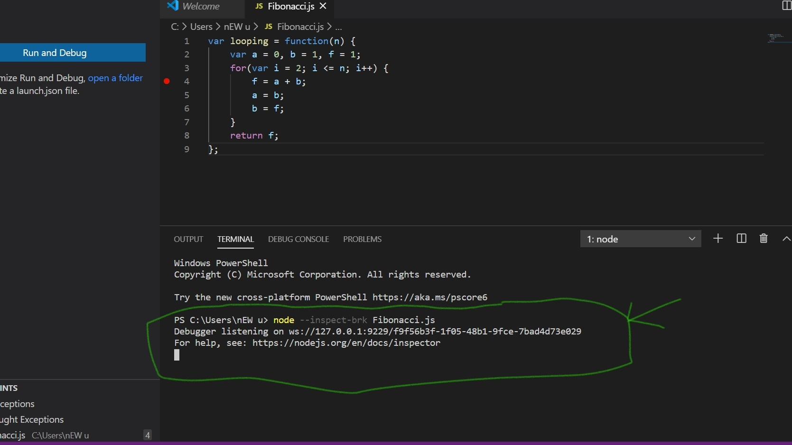
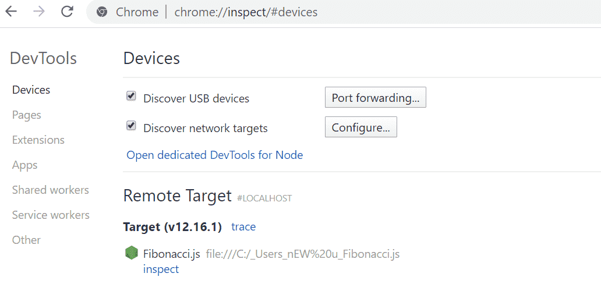
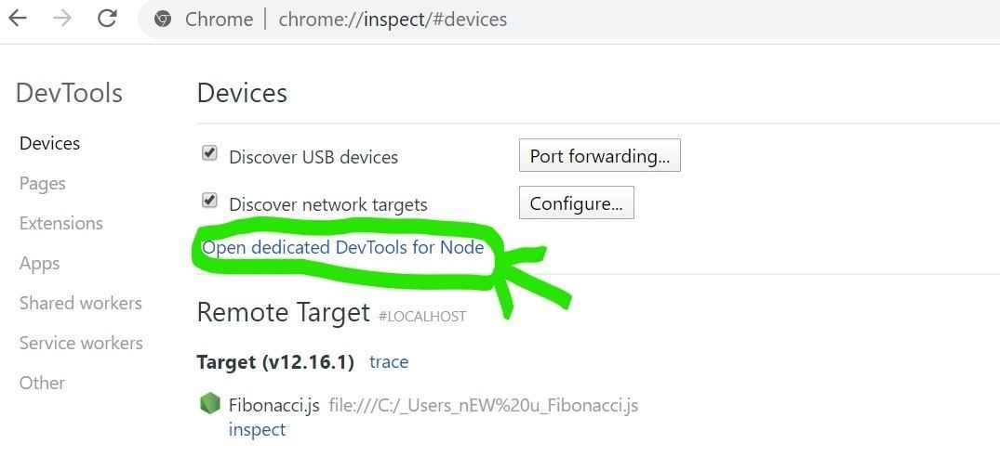
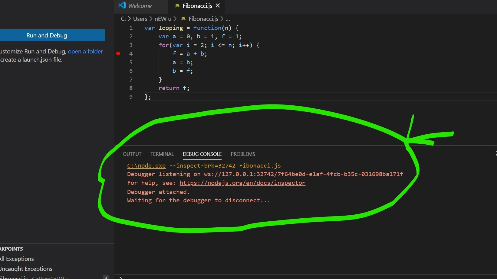

# Node Debugging

Debugging is the process of identifying and fixing errors to ensure an application runs smoothly. Node.js provides various built-in tools to help troubleshoot and debug applications efficiently.

- They help in identifying runtime errors.
- Improves code efficiency by detecting memory leaks.
- Enables developers to monitor application execution flow.
- Ensures error-free and reliable applications.

<strong>Ways to Debug Node.js Applications</strong>

Although console.log() is useful for basic debugging, advanced tools provide a more efficient and structured way to debug complex Node.js applications.

- console.log() is useful for quick value checks and tracing execution.
- Excessive logging can clutter code and reduce readability.
- Logs alone are inefficient for debugging complex applications.
- Debugging tools provide breakpoints and step-by-step execution.
- Advanced tools enable call stack analysis and variable inspection.

<strong>Adding a Debugger to Debug Your Code</strong>

While console.log() is commonly used, it's not the most efficient for complex debugging tasks. Instead, you can use the V8 Inspector in NodeJS.

Steps for debugging in Node

Step 1: Write the following code in the terminal window as shown below:

```bash
node --inspect-brk filename.js
```



---

Step 2: Open your Chrome browser and write inspect as shown below



---

Step 3: Now click on Open Dedicated DevTools for Node.



---

Step 4: Now, click on the NodeJS icon. The terminal will show the following message:



Step 5: Other tools to help launch a DevTools window:

> june07.com/nim
> github.com/jaridmargolin/inspect-process
> github.com/darcyclarke/rawkit

