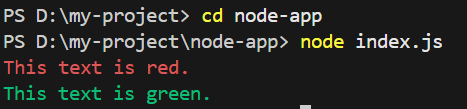

# Changing Text Color in the Node.js Console

In Node.js, console font colors can be customized for better readability during debugging and logging using ANSI escape codes or third-party libraries.

- Node.js does not provide native support for changing console font colors.
- ANSI escape codes can be used to manually format colored output.
- Third-party libraries like chalk and colors simplify color styling.
- Colored logs improve clarity and debugging efficiency.

<strong>Using ANSI Escape Codes (No External Library)</strong>

In Node.js, console text color can be changed using ANSI escape codes, which apply terminal-level formatting without requiring external libraries.

Steps to Use ANSI Escape Codes:

- Define the ANSI escape codes for different colors.
- Use these codes in your console.log statements.

```js
// ANSI escape codes for text color
const red = '\x1b[31m';
const green = '\x1b[32m';
const reset = '\x1b[0m';

// Use the escape codes to change font color
console.log(red + 'This text is red.' + reset);
console.log(green + 'This text is green.' + reset);
```



\x1b[31m sets the text color to red.
\x1b[32m sets the text color to green.
\x1b[0m resets the color back to the default.

<strong>Common ANSI Escape Codes for Colors</strong>

- \x1b[31m: Red
- \x1b[32m: Green
- \x1b[33m: Yellow
- \x1b[34m: Blue
- \x1b[35m: Magenta
- \x1b[36m: Cyan
- \x1b[37m: White

This method allows you to manually format text, but keep in mind that some terminals might not support or have disabled ANSI escape codes by default. If you encounter issues, consider using third-party libraries like chalk for cross-platform color formatting in the console.

---

<strong>Using chalk Library</strong>

chalk is a popular and flexible NodeJS library that allows you to style strings in the console. It provides a range of colors and styles to format your console output.

Steps to Use chalk
Step 1: Install chalk via npm
```bash
npm install chalk
```

Step 2: import the chalk library
```js
import chalk from 'chalk';

console.log(chalk.green('Success: Everything is working fine!'));
console.log(chalk.yellow('Warning: Please check your input.'));
console.log(chalk.red('Error: Something went wrong.'));
```
- import chalk from 'chalk' imports the chalk library, which allows you to style and color text in the terminal.
- chalk.green(), chalk.yellow(), and chalk.red() are used to change the text color to green, yellow, and red respectively.

---

<strong>Applications of Changing Console Font Color</strong>

- Error Handling: You can display errors in red to make them stand out.
- Debugging Logs: Useful for distinguishing between different log levels (info, warn, error).
- User Interfaces: Enhance console-based user interfaces with colorful outputs for better user interaction.