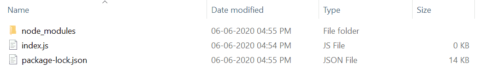

# Node.js assert() Function

The assert() function in Node.js is used to test conditions and validate assumptions in code, throwing an error if a condition evaluates to false.

- Part of the built-in assert module used for testing and debugging.
- Throws an Assertion Error if the provided condition is not truthy.
- Helps detect bugs by validating expected outcomes during development.

Syntax:

```js
assert(value[, message])
```
- value: This parameter holds the expression that needs to be evaluated. It is of any type.
- message: This parameter holds the error message of string or error type. It is an optional parameter.

Return Value: This function returns assertion error of object type.

---

<strong>Installation of assert module (optional)</strong>

The assert module is a built-in core module in Node.js, so no separate installation is required. It can be imported directly using:

```js
npm install assert
```

> Note: Installation is an optional step as it is inbuilt Node.js module.

After installing the assert module, you can check your assert version in command prompt using the command.

```
npm version assert
```

After that, you can just create a folder and add a file for example, index.js as shown below.

Example 1: Uses Node.js assert module to assert a falsy value (0), catches the resulting error, and logs it.

```js
// Requiring the module
const assert = require('assert').strict;

// Function call
try {
	assert(0)
} catch(error) {
	console.log("Error:", error)
}
```
The project structure will look like this:


Run index.js file using below command:
```
node index.js
```
Output:
```js
Error: AssertionError [ERR_ASSERTION]: The expression evaluated to a falsy value:

    assert(0)

    at Object.<anonymous> (C:\Users\Lenovo\Downloads\index.js:6:5)
    at Module._compile (internal/modules/cjs/loader.js:1138:30)
    at Object.Module._extensions..js (internal/modules/cjs/loader.js:1158:10)
    at Module.load (internal/modules/cjs/loader.js:986:32)
    at Function.Module._load (internal/modules/cjs/loader.js:879:14)
    at Function.executeUserEntryPoint [as runMain] (internal/modules/run_main.js:71:12)
    at internal/main/run_main_module.js:17:47

{
  generatedMessage: true,
  code: 'ERR_ASSERTION',
  actual: 0,
  expected: true,
  operator: '=='
}
```

- The assert module is used to check conditions in Node.js.
- assert(0) fails because 0 is a falsy value.
- An error is thrown when the assertion fails.
- The try...catch block catches the error.
- The error message is printed to the console.

---

Example 2: Uses the Node.js assert module to validate a truthy value and logs “No Error Occurred” if the assertion passes, otherwise catches and displays the error.


```js
// Requiring the module
const assert = require('assert').strict;

// Function call
try {
	assert(1)
	console.log("No Error Occurred")
} catch(error) {
	console.log("Error:", error)
}
```

Output:
```
No Error Occurred
```

- The assert module is used to check conditions in Node.js.
- assert(1) passes because 1 is a truthy value.
- No error is thrown when the assertion is true.
- The try...catch block is not triggered.
- "No Error Occurred" is printed to the console.


