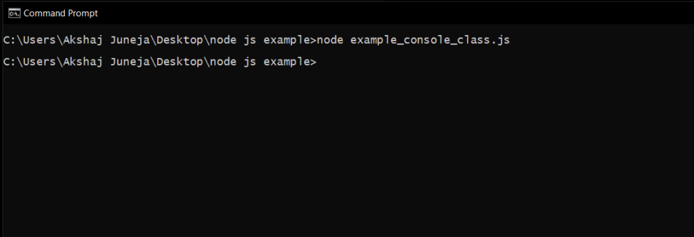
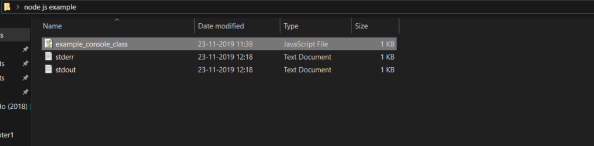

# Node.js Console

The console module in Node.js is a built-in utility used for logging, debugging, and displaying runtime information through standard output and error streams.

- Provides methods to print messages and debug application behavior.
- Accesses standard output and error streams for logging.
- Available as a global object without requiring import.
- Supports common methods like console.log(), console.error(), and console.warn().
- Includes the Console class for advanced logging control.

Example: Make a file and save it as example_console_class.js with the following code in the file.

```js
// It requires the fs module 
const fs = require('fs');

const out = fs.createWriteStream('./stdout.log');
const err = fs.createWriteStream('./stderr.log');

const myobject = new console.Console(out, err);

// It will display 'This is the first example' to out
myobject.log('This is the first example');

// It will display 'This is the second example' to out
myobject.log('This is the %s example', 'second');

// It will display 'Error: In this we creating some error' to err
myobject.error(new Error('In this we creating some error'));

const num = 'third';

// It will display 'This is the third error' to err
myobject.warn(`This is the ${num} example`);
```

- A custom console object is created using the Console class.
- Output streams can be configured for logging and error messages.
- The Console class instance is created using console.Console.
- This allows greater control over where and how logs are written.

Now, we will execute example_console_class.js script file in command prompt by navigating to the folder where it exists like as shown below.



The above node.js example will create a log files (stdout & stderr) in the folder where example_console_class.js file exists with required messages like as shown below.



Example of Global Console Object: Create a file and save it as example_console_object.js with the following code in the file.

```js
// It will display 'This is the first object example' to stdout
console.log('This is the first object example');

// It will display 'This is the second object example' to stdout
console.log('This is the %s example', 'second object');

// It will display 'Error: New Error has happened' to stderr
console.error(new Error('New Error has happened'));

const obj = 'third object';

// It will display 'This is the third object example' to stderr
console.warn(`This is the ${obj} example`);
```

- Messages are written to Node.js streams using the global console object.
- Methods such as console.log(), console.error(), and console.warn() are used for output.
- The global console object is available without using the require directive.
- This allows quick and easy logging within Node.js applications.

---

<strong>Console Methods</strong>

Apart from above three methods (console.log(), console.error(), console.warn()), few other methods also available in node.js console object to write or print a messages in node.js stream.

console.count(): It is used to count the number of times a specific label has been called.
console.clear(): It is used to clear the console history.
console.info(): It is used to write a messages on console and it is an alias of console.log() method.
console.time(): It is used to get the starting time of an action.
console.timeEnd(): It is used to get the end time of specific action.
console.dir(): It use util.inspect() on object and prints the resulting string to stdout.

---

<strong>Advantages</strong>

Here are some advantages of console module:

- Simplifies debugging by allowing developers to print and inspect values at different stages of program execution.
- Provides a simple API with multiple logging methods for handling different debugging and monitoring needs.
- Helps measure execution time and identify performance bottlenecks using built-in timing functions.
- Displays objects and tabular data in a structured format using methods like console.dir() and console.table().
