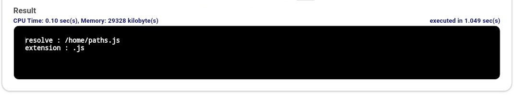
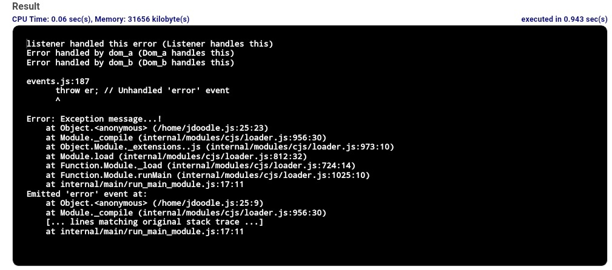

# Utility Module in Node.js

The util module in Node.js provides utility functions for tasks such as debugging, string formatting, and object inspection. It helps developers write more flexible and maintainable code.

- Provides utilities for debugging and formatting output.
- Includes methods for object inspection and class inheritance.
- Enhances code functionality and development efficiency in Node.js applications.

Syntax

```js
const util = require('util');
```

```js
// Import util module
const util = require('util');

// Format a string
const formattedString = util.format('Hello %s!', 'world');
console.log(formattedString);

// Inspect an object
const obj = { name: 'John', age: 30 };
console.log(util.inspect(obj, { showHidden: false, depth: null }));

```

<strong>Node.js Core Module</strong>

Node.js Core Modules provide built-in functionalities for handling system operations, file paths, networking, and error management in Node.js applications.

<details>
    <summary><strong>1. OS Module</strong></summary>
    
Operating System-based utility modules for node.js are provided by the OS module. 

Syntax:
```js
const os = require('os');
```

```js
// Require operating System module
const os = require("os");

// Display operating System type
console.log('Operating System type : ' + os.type());

// Display operating System platform
console.log('platform : ' + os.platform());

// Display total memory
console.log('total memory : ' + os.totalmem() + " bytes.");

// Display available memory
console.log('Available memory : ' + os.availmem() + " bytes.");
```
Output : 

</details>

---

<details>
    <summary><strong>2. Path Module</strong></summary>
    
The path module in node.js is used for transforming and handling various file paths. 

Syntax:
```js
const path = require('path');
```

```js
// Require path
const path = require('path');

// Display Resolve
console.log('resolve:' + path.resolve('paths.js'));

// Display Extension
console.log('extension:' + path.extname('paths.js'));
```

Output:


</details>

---

<details>
    <summary><strong>3. DNS Module</strong></summary>
    
The DNS module provides APIs for DNS resolution and hostname lookups using the operating system’s name resolution services.

Syntax:
```js
const dns = require('dns');
```

```js
// Require dns module
const dns = require('dns');

// Store the web address
const website = 'www.geeksforgeeks.org';

// Call lookup function of DNS
dns.lookup(website, (err, address, family) => {
    console.log('Address of %s is %j family: IPv%s',
        website, address, family);
});
```
Output:
```
Address of www.geeksforgeeks.org is "203.92.39.72"
family: IPv4
```
</details>

---

<details>
    <summary><strong>4. Net Module</strong></summary>
    
Net Module in node.js is used for the creation of both client and server. Similar to DNS Module this module also provides an asynchronous network wrapper. 

 Syntax:
```
const net = require('net');
```

Example: This example contains the code for the server side. 

```js
// Require net module
const net = require('net');

const server = net.createServer(function (connection) {
    console.log('client connected'); connection.on('end', function () {
        console.log('client disconnected');
    });
    connection.write('Hello World!\r\n'); connection.pipe(connection);
});

server.listen(8080, function () {
    console.log('server listening');
});
```

Output:
```
Server listening
```

Example: This example is containing the client side in the net Module. 
```js
const net = require('net');

const client = net.connect(8124, function () {
    console.log('Client Connected');
    client.write('GeeksforGeeks\r\n');
});

client.on('data', function (data) {
    console.log(data.toString());
    client.end();
});

client.on('end', function () {
    console.log('Server Disconnected');
});
```

Output:
```
Client Connected 
GeeksforGeeks
Server Disconnected
```
</details>

---

<details>
    <summary><strong>5. Domain Module</strong></summary>
    
The Domain module in Node.js is used to handle and intercept unhandled errors in asynchronous operations. It groups multiple I/O operations into a single context so that errors can be handled together.

Error interception can be performed in two ways:

- Internal Binding: The error emitter runs the code internally within the run() method of a domain.
- External Binding: The error emitter is explicitly added to the domain using the add() method.
> Note: The Domain module is deprecated and should not be used in modern Node.js applications.

Syntax:
```js
const domain = require('domain');
```
The domain class provides a mechanism for routing unhandled exceptions and errors to the active domain object. It is considered a child class of EventEmitter.

```js
const EventEmitter = require("events").EventEmitter;
const domain = require("domain");
const emit_a = new EventEmitter();
const dom_a = domain.create();

dom_a.on('error', function (err) {
    console.log("Error handled by dom_a (" + err.message + ")");
});

dom_a.add(emit_a);
emit_a.on('error', function (err) {
    console.log("listener handled this error (" + err.message + ")");
});

emit_a.emit('error', new Error('Listener handles this'));
emit_a.removeAllListeners('error');
emit_a.emit('error', new Error('Dom_a handles this'));
const dom_b = domain.create();

dom_b.on('error', function (err) {
    console.log("Error handled by dom_b (" + err.message + ")");
});

dom_b.run(function () {
    const emit_b = new EventEmitter();
    emit_b.emit('error', new Error('Dom_b handles this'));
});

dom_a.remove(emit_a);
emit_a.emit('error', new Error('Exception message...!'));
```
Output:

</details>

---

<details>
    <summary><strong>Advantages</strong></summary>
    
- Enhanced Debugging: Provides powerful tools for inspecting and debugging objects.
- Simplified Async Handling: Makes it easier to work with asynchronous code by converting callback-based APIs to promise-based ones.
- Flexible String Formatting: Allows dynamic and customizable string formatting.
</details>